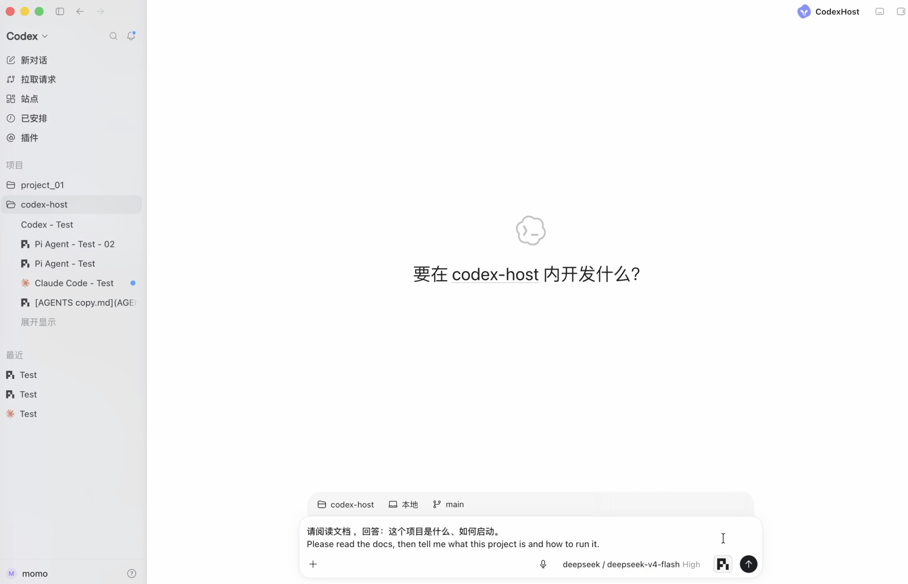
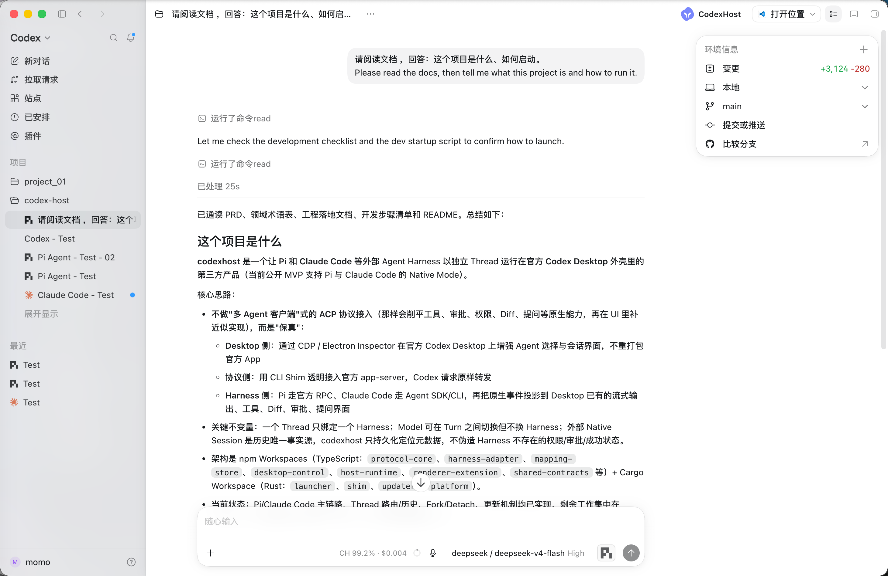
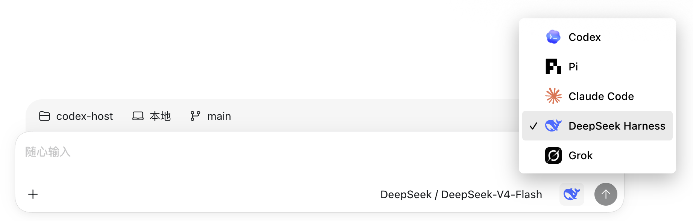
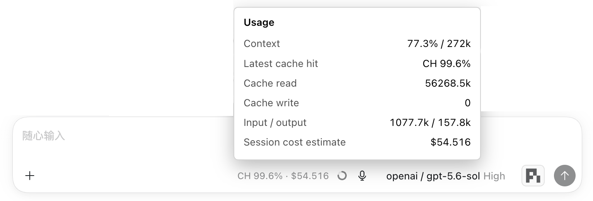
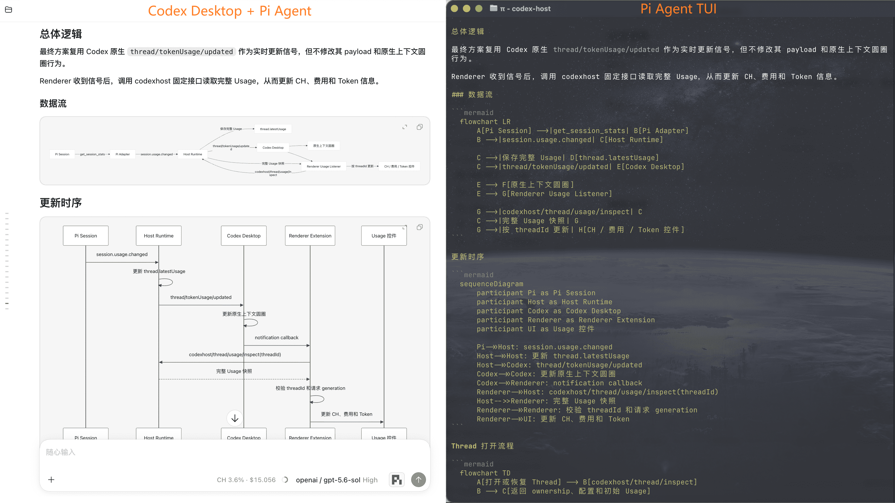
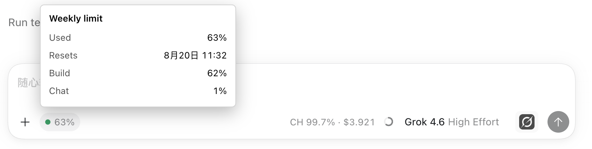

<div align="center">

# CodexHost

**在 Codex Desktop 中运行 Pi 和其他 Harness**

我们认为 **Codex Desktop** 提供了目前最好的桌面开发交互体验。

但 **Codex** 并不是唯一优秀的 **Agent Harness**，也有人偏好 **Claude Code** 和 **Pi Agent**。

**CodexHost** 让你在 **Codex Desktop** 中选择真正执行任务的 **Agent**，同时保留 **Codex** 的原生体验。

⭐ 如果这个项目对你有帮助，请给我们一个 Star！⭐

<p>
  <a href="https://opensource.org/licenses/MIT"></a>
  <a href="https://linux.do"></a>
</p>

<p>
  <a href="https://pi.dev/"></a>
  <a href="https://openai.com/codex/"></a>
  <a href="https://code.claude.com/docs/en/quickstart"></a>
  <a href="https://github.com/deepseek-ai/deepseek-harness"></a>
  <a href="https://grok.com/"></a>
</p>

<p align="center">
  <sub>简体中文 · <a href="docs/README.en.md">English</a> · <a href="docs/README.ko.md">한국어</a></sub>
</p>
</div>

## 界面预览

无需切换应用，**Pi、Claude Code、Grok Build 和 DeepSeek Harness** 都可以在同一个 Codex Desktop 窗口中直接使用。



### 界面



## 功能状态

| 能力 | Codex | Pi | Claude Code | Grok Build | DeepSeek Harness |
| --- | --- | --- | --- | --- | --- |
| 流式回复 | 原生 | ✅ | ✅ | ✅ | ✅ |
| Thinking | 原生 | ✅ | ✅ | ✅ | — |
| 工具状态 | 原生 | ✅ | ✅ | ✅ | ✅ |
| Edit Diff | 原生 | ✅ | ✅ | ✅ | ✅ |
| 提问 / 取消 | 原生 | ✅ | ✅ | ✅ | ✅ |
| Model / Thinking 选择 | 原生 | ✅ | ✅ | ✅ | 🚧 |
| 工具审批 | 原生 | ✅ | ✅ | ✅ | ✅ |
| 权限模式 | 原生 | — | ✅ | ✅ | — |
| Usage | 原生 | ✅ | ✅ | ✅ | ✅ |
| 会话恢复 | 原生 | ✅ | ✅ | ✅ | ✅ |
| Fork | 原生 | ✅ | ✅ | ✅ | — |
| 上下文压缩 | 原生 | ✅ | ✅ | ✅ | ✅ |
| 斜杠命令 | 原生 | ✅ | 🚧 | ✅ | — |
| 修订上一条消息 | 原生 | ✅ | 🚧 | ✅ | — |

> **SSH 远程 Harness**：✅ 支持通过 Codex Desktop 原生 SSH 工作区使用远程节点上的 Harness。

## 快速使用

**方式一：使用 npm**

```bash
npm install -g @codexhost/cli
codexhost
```

npm 支持 macOS、Windows 和 [x64 Linux](docs/linux.zh-CN.md)。

**方式二：下载安装包**

从 [GitHub Releases](https://github.com/BytePioneer-AI/codex-host/releases) 下载最新版安装包，并选择与你的操作系统和 CPU 架构对应的文件。目前安装包支持 macOS 和 Windows。

macOS 安装后，如果首次打开时提示 Apple 无法验证该应用，请在终端执行：
```bash
xattr -dr com.apple.quarantine /Applications/codexhost.app
```
然后重新打开 `codexhost`。

Windows 上如果使用绿色解压版 Codex Desktop，请在启动 codexhost 前手动设置 `CODEXHOST_INSTALL_ROOT`，将其指向包含 `app\ChatGPT.exe` 的目录：

```powershell
[Environment]::SetEnvironmentVariable("CODEXHOST_INSTALL_ROOT", "D:\CodexPortable", "User")
```

然后重新打开终端并启动 codexhost。NPM 命令和 Windows 安装版都适用。

### SSH 远程 Harness

在本机的 Codex Desktop 中，通过 SSH 连接并控制其他开发节点上的 Harness，在远程机器执行任务，同时继续使用 Codex Desktop 的统一界面。

两端需要安装相同版本的 codexhost，并确保 Codex Desktop 原生 SSH 工作区已经可以正常使用。

| 客户端 ↓ / 远程 Host → | macOS | Linux | Windows |
| --- | --- | --- | --- |
| macOS | ✅ | ✅ | ❌ |
| Linux | ✅ | ✅ | ❌ |
| Windows | ✅ | ✅ | ❌ |

Windows 可以作为客户端，但暂不支持作为远程 Host；远程 Host 目前仅支持 macOS 和 Linux。

在 SSH 远程主机上执行：

```bash
npm install -g @codexhost/cli
codexhost remote install
codexhost remote start
codexhost remote status
```

然后通过本地 codexhost 启动 Codex Desktop，打开 SSH 工作区，在远程输入框的 Agent/Model 选择器中选择目标 Harness。

[查看远程 SSH 配置、诊断与卸载文档 →](docs/remote-ssh-host.zh-CN.md)

<details>
<summary><h3>怎么做的</h3></summary>

多数「多 Agent 客户端」通过 [ACP](https://agentclientprotocol.com/) 协议接入不同 Harness。接入快，但工具、审批、权限、Diff、提问等原生能力会先被削平，再在 UI 里补一层近似实现。

CodexHost 尽量不走这条路：

- **Desktop 侧**：用 CDP / Electron Inspector 在官方 Codex Desktop 上增强 Agent 选择与会话界面，不重做聊天壳，也不改官方安装包
- **协议侧**：用 CLI Shim 透明接入官方 app-server；Codex 请求原样转发
- **Harness 侧**：按各自原生接口接入——Pi 走官方 RPC，Claude Code 走 Agent SDK / CLI——再投影到 Desktop 已有的流式输出、工具、Diff、审批和提问

目标是保真，不只「能聊」。流式、工具状态、可靠 Patch、原生审批和提问，都尽量来自 Harness 自己，而不是 Host 猜测或伪造。

</details>

### 交互展示

<table>
  <tr>
    <td width="50%" valign="top">
      <p><strong>Agent 与 Model 选择</strong></p>
      
    </td>
    <td width="50%" valign="top">
      <p><strong>Usage 与费用信息</strong></p>
      
    </td>
  </tr>
  <tr>
    <td colspan="2" valign="top">
      <p><strong>Mermaid 图表可视化渲染</strong></p>
      
    </td>
  </tr>
  <tr>
    <td colspan="2" valign="top">
      <p><strong>Grok 效果展示</strong></p>
      
    </td>
  </tr>
</table>

## 鸣谢

- 感谢 [LINUX DO](https://linux.do/) 社区一直以来的支持。
- 感谢 [Paseo](https://github.com/getpaseo/paseo) 项目在多 Harness 接入思路与架构设计方面带来的启发与参考。
