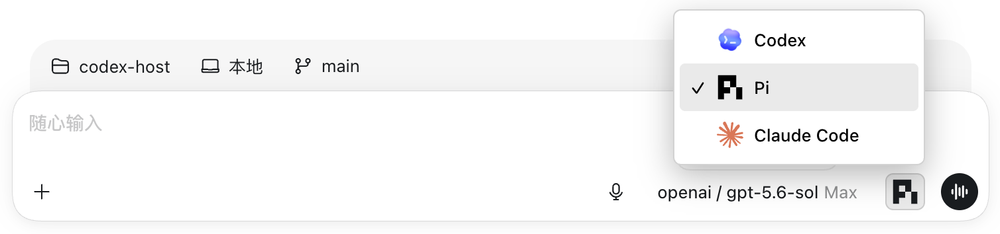

<div align="center">

# codexhost

**Run Pi and Claude Code inside [Codex Desktop](https://openai.com/codex/)**

We believe **Codex Desktop** currently provides one of the best desktop development experiences.

But **Codex** is not the only capable **Agent Harness**. Some developers prefer **Claude Code** or **Pi Agent**.

**codexhost** lets you choose the **Agent** that actually executes your tasks inside **Codex Desktop**, while preserving the native Codex experience.

<p>
  <a href="https://opensource.org/licenses/MIT"></a>
  <a href="https://linux.do"></a>
</p>

<p><a href="../README.md">中文 README</a></p>

</div>

## Preview

Pi and Claude Code run as independent sessions in the same Codex Desktop window. Streaming output, tool status, diffs, approvals, and questions are rendered in real time.


### Interface


## Feature Status

| Capability | Codex | Pi | Claude Code |
| --- | --- | --- | --- |
| Streaming replies | Native | ✅ | ✅ |
| Tool status | Native | ✅ | ✅ |
| Edit diffs | Native | ✅ | ✅ |
| Ask / cancel | Native | ✅ | ✅ |
| Model / thinking | Native | ✅ | ✅ |
| Permission modes | Native | - | ✅ |
| Session resume | Native | ✅ | ✅ |
| Thread management | Native | ✅ | 🚧 |
| Fork | Native | ✅ | ✅ |
| Context compaction | Native | ✅ | ✅ |
| Slash commands | Native | 🚧 | 🚧 |
| Revise the previous message | Native | ✅ | 🚧 |

## Quick Start

**Option 1: Install with npm**

```bash
npm install -g @codexhost/cli
codexhost
```

**Option 2: Download an installer**

Download the latest installer from [GitHub Releases](https://github.com/BytePioneer-AI/codex-host/releases), then choose the file matching your operating system and CPU architecture.

After installing on macOS, if Apple says it cannot verify the app when you first open it, run the following command in Terminal:
```bash
xattr -dr com.apple.quarantine /Applications/codexhost.app
```
Then open `codexhost` again.

<details>
<summary><h3>How it works</h3></summary>

Most multi-agent clients connect different Harnesses through the [ACP](https://agentclientprotocol.com/) protocol. This is fast to integrate, but native capabilities such as tools, approvals, permissions, diffs, and questions are flattened first and then approximated again in the client UI.

codexhost takes a different approach:

- **Desktop layer:** Use CDP / Electron Inspector to enhance the official Codex Desktop with Agent selection and session controls. The chat shell is not recreated, and the official installer is not modified.
- **Protocol layer:** Use a CLI shim to transparently connect to the official app-server and forward Codex requests unchanged.
- **Harness layer:** Connect through each Harness's native interface: Pi uses the official RPC, while Claude Code uses the Agent SDK / CLI. Their events are then projected into the Desktop's existing streaming output, tool, diff, approval, and question UI.

The goal is fidelity, not merely making the conversation work. Streaming, tool status, reliable patches, native approvals, and questions should come from the Harness itself wherever possible, rather than being guessed or simulated by the Host.

</details>

### Interaction Examples

<table>
  <tr>
    <td width="50%" valign="top">
      <p><strong>Agent and Model selection</strong></p>
      
    </td>
    <td width="50%" valign="top">
      <p><strong>Usage and cost information</strong></p>
      
    </td>
  </tr>
  <tr>
    <td colspan="2" valign="top">
      <p><strong>Mermaid diagram rendering</strong></p>
      
    </td>
  </tr>
</table>
