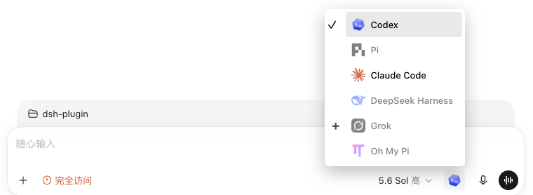
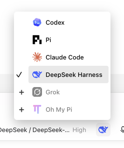

# DeepSeek Harness model-description fix evidence

This record captures the same live DeepSeek Harness instance before and after the
adapter fix. It intentionally excludes endpoints, local paths, credentials, account
details, and model/provider names.

## Environment

- Captured at: `2026-08-30T20:46:29Z`
- DeepSeek Harness CLI: `0.1.1-rc.2`
- Node.js: `v24.16.0`
- npm: `11.13.0`
- Baseline codexhost commit: `dea7498527b47eac4e12e977569588230d065a97`
- Fixed codexhost commit: `e9aaad3ea640aae8758d21e6eebcc03b414e9a30`

Both revisions were built with `npm run build:typescript`. The probe instantiated
`DeepSeekHarnessAdapter`, called `inspect({ refresh: true })`, printed only the
sanitized inspection result shown below, and then closed the adapter.

## Before

The baseline was built in a clean detached worktree at the upstream `v0.4.0`
commit. Its live inspection returned:

```json
{
  "status": "unavailable",
  "error": {
    "code": "unavailable",
    "stage": "model-catalog",
    "retryable": true,
    "message": "[\n  {\n    \"code\": \"unrecognized_keys\",\n    \"keys\": [\n      \"description\"\n    ],\n    \"path\": [\n      \"models\",\n      2\n    ],\n    \"message\": \"Unrecognized key: \\\"description\\\"\"\n  }\n]"
  }
}
```

The following affected-state Host menu screenshot was supplied with the original
bug report and shows DeepSeek Harness disabled:



## After

The fixed branch was built and inspected against the same running Harness:

```json
{
  "status": "ready",
  "modelCount": 30,
  "thinkingOptionCount": 7,
  "defaultModelPresent": true
}
```

The corresponding Host menu rendered DeepSeek Harness as selectable:



For this screenshot, Codex Desktop was launched with the fixed branch's native
launcher, Host Runtime, Desktop Controller, and Renderer bundle. The live option
was clicked before capture. Renderer state after the click was:

```json
{
  "triggerTitle": "Agent: DeepSeek Harness",
  "optionDisabled": false,
  "optionAriaChecked": "true",
  "optionRole": "menuitemradio"
}
```

The screenshot was captured from the live Electron `webContents` and cropped to
the agent menu. It is not a generated or mock image.

## Automated regression coverage

The adapter test fixture now includes a native model description and requires
`adapter.inspect()` to return a ready catalog. Before the production fix, that
test returned `unavailable`; after the fix it passes.

Local validation of the fixed revision:

- DeepSeek Harness adapter tests: 51 passed.
- TypeScript suite: 1,483 passed and 7 skipped across 173 files.
- `npm run lint`: passed.
- `npm run typecheck`: passed.
- `npm run build:typescript`: passed.
