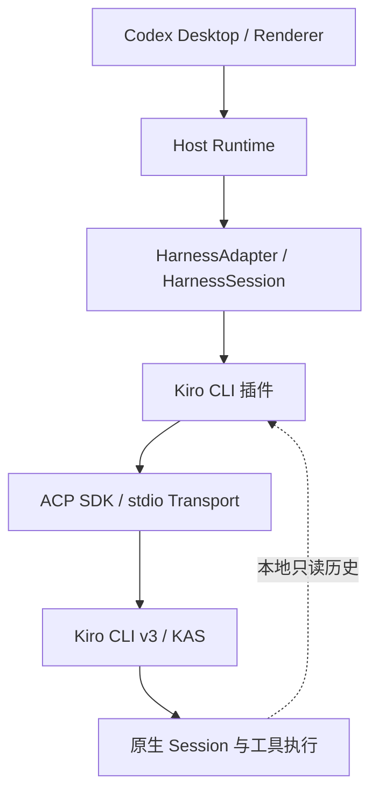

# Kiro CLI ACP 适配调研与实施说明

> 调研日期：2026-09-06。结论基于本机更新后的 Kiro CLI `2.21.1`、其 `v3` 引擎/KAS `0.58.7`、ACP 协议版本 `1`。
>
> **本文是有实测证据的适配设计，不是已经完成的 Adapter。** 本次只升级本机 CLI、运行隔离探针、编写文档和证据复核脚本，没有实现插件、修改生产适配代码或启动 Desktop 验收。

### PR #8 修复补记（2026-09-06）

以上说明及证据摘要保留原始调研时点，不代表后续实现状态。本次针对 PR #8 修复了流式文本共享对象、工具终态与 Diff 预览重复发布、原生 Turn 身份、历史正文/工具字段和取消状态、关闭时终态丢失、Thread 环境覆盖、模型目录与默认选择、配置生效确认，以及查询命令无可见结果的问题；补齐 Sidebar ownership 的 Kiro 映射。

- `inspect` 使用无 Session、无 Prompt 的原生模型列表命令；创建时省略的模型保持省略，初始与切换后状态来自原生确认。
- 工具保留前序参数及类型，只结束一次；只有成功终态携带的 Diff 才发布文件修改，孤立的初始化工具更新不归入当前 Turn。
- 历史读取保留原生正文、工具结果、顺序、身份和终态；缺少终态为 unknown，缺失或损坏的历史明确报错，不返回伪造空快照。
- `/kiro-usage` 与 `/kiro-context` 通过普通消息展示脱敏的原生查询结果，不伪造持久化 Native Turn，也不将 credits 换算成 USD/token。本次未新增 Usage 面板契约。
- 验证包括定向单元测试、Host 投影检查，以及原调研纯文本、编辑、拒绝、阻塞关闭和历史记录的离线回放；另只读核对了原生模型列表。未发出模型 Prompt、未启动 Desktop，未重新验收真实文件写入、完整委派或其他平台；Thinking 和无人值守全权限限制保持不变。

后续显示修复：实时回答按原生 `_meta.kiro.replayId` 与工具开始边界分段，中间汇报映射为 `commentary`，成功结束时的尾部回答映射为 `final_answer`，不再将跨工具的文字拼成首条消息。公共消息阶段字段可选，未提供的其他 Harness 保持原投影行为。历史使用同样的阶段划分，并通过可选的原生 Turn 起止时间恢复用时；缺失或无效时间不虚构耗时。Desktop 的原生折叠及用时展示依赖最终消息阶段和 Turn duration，本次不新增 Renderer 折叠控件。分段、阶段与时间的流式/历史投影有定向回归覆盖；原生 UI 字段条件已核对，修复后的 Desktop 画面仍需实机复测。

Usage 面板补记：现已复用输入框的公共用量控件，新增可选 `totalCredits`（当前 Thread 已记录的原生 credits 累计值）与 `contextUsagePercent`（独立上下文比例）。创建/恢复时读取原生 `usage_summary`，实时处理 `turn_completion`、`context_usage`，按原生请求 ID 集合或执行 ID 去重；主动刷新重读账目并查询原生上下文，查询失败保留已知值。入口沿用紧凑摘要样式，只显示 credits 数值，百分比留在详情和无障碍标签中；不额外绘制上下文圆环，不修改 Codex 原生 Context 组件。展开面板先列上下文，末尾以“已记录消耗”列出 credits，不将账户额度、未计量取消或失败当作完整 Thread 账单，不换算 USD。当前证据没有可靠的账单输入/输出、缓存读取/写入或命中率；上下文 breakdown 的提示/回答 token 数不是这些指标，因此保持缺省而不是填零。原始第 12 节是调研时的方案，当前仅增加上述两个字段，没有引入通用计费单位框架。定向测试覆盖去重、恢复、刷新和无效数据，浏览器测试覆盖 1280px/375px 的实际控件显示和切换清理；未重新发起模型 Prompt 或重启 Desktop。

## 1. 结论

**ACP 方案可行，推荐以最新版 CLI 的显式 `v3` 引擎作为新插件主线。**

建议的产品身份：

- Harness/插件 ID：`kiro-cli`。
- Desktop 显示名称：`Kiro CLI`。
- 建议源码包：`packages/adapters/kiro-cli`。
- 原生启动方式：`kiro-cli acp --agent-engine v3 --auth-method cli`。
- 原生协议负责执行；必要的本地只读历史读取负责完整快照和历史校验。
- 保留 `HarnessAdapter` / `HarnessSession` 作为 Host 唯一业务契约，不让 Host 或 Renderer 理解 Kiro ACP 私有字段。

已经实际验证的主要能力包括：流式回复、工具生命周期、真实文件更新 Diff、工具审批、审批期间取消、取消后恢复执行、特定模式下的结构化提问及回答、模型切换、Autopilot 配置、原生子 Agent 调用、原生 Usage、手动压缩、精确历史 Fork、空前缀 Fork、跨目录 Fork，以及跨进程恢复后的稳定历史身份。

**不能因此承诺所有截图功能已经完整接入。** 尤其有四项需要区别处理：

1. 当前可用模型没有可确认的 Thinking 档位；不能把一个没有生效状态的成功 RPC 当成支持。
2. `v3` 的 Autopilot 不等于无人值守全权限，当前 ACP 入口又拒绝 `--trust-all-tools`。完整跨 Harness 无人值守委派仍有原生执行策略缺口。
3. credits、纯上下文百分比不能准确塞入现有 USD/token 字段，完整 Usage UI 需要小范围公共契约扩展。
4. “修改上一条消息”必须通过精确前缀 Fork、配置恢复和 Host 替换事务实现；不能直接把 Kiro 名为 rewind 的操作当作已满足本仓库的 Rollback 契约。

文末按照“协议/产品固有限制、当前版本问题、仓库缺口、未验证”分别列出限制，避免把暂时没有打通的能力误称为天生缺陷。

## 2. 版本、环境与证据边界

### 2.1 本机基线

| 项目 | 本次核实结果 |
| --- | --- |
| 更新前 | `kiro-cli-chat 2.19.2` |
| 官方更新器发现 | `2.19.2 -> 2.21.1` |
| 更新后 | `kiro-cli-chat 2.21.1` |
| 更新后复查 | `You are on the current version (2.21.1)` |
| 实际程序 | `%LOCALAPPDATA%\Kiro-Cli\kiro-cli.exe` |
| 登录 | `whoami --format json` 返回退出码 0；未保存身份正文或凭据 |
| 操作系统 | Windows，本机原生程序，不经过 WSL |
| CLI 默认 ACP 引擎 | `v2` |
| 主线探针 | 显式 `--agent-engine v3 --auth-method cli` |
| v3 内部服务 | 启动日志报告 KAS `0.58.7` |
| ACP 协商结果 | `protocolVersion: 1` |
| Node.js | `v24.18.0` |
| 仓库已有 ACP SDK | `@agentclientprotocol/sdk 1.3.0`，本次未增加依赖 |
| 真实 Prompt 使用的 Model | `claude-haiku-4.5` |
| 仓库版本 | `0.5.0` |
| 仓库 HEAD | `443271cfec6e0fefc6a3d54607e9fd0871456bc0` |

现场检查跨越了本地午夜：升级在 `2026-09-05` 晚间完成，文档在 `2026-09-06` 整理。原始探针使用 UTC 时间，主要记录覆盖 `2026-09-06T06:33Z` 至 `07:03Z`，不能根据文件名误判为另一批版本测试。

这里的“最新”指**本次执行时官方稳定更新器给本机提供的版本**，不是对未来版本的保证。CLI 版本、`v2/v3` 引擎选择、KAS 版本、ACP 协议版本、插件 API 版本是五个不同的维度，不得混用。

### 2.2 操作边界

- 更新沿用本机已有 Kiro CLI 安装位置，没有新增语言工具链。
- 模型 Prompt、文件修改、Fork、压缩和取消只针对本次创建的测试会话。
- 工作目录位于 `D:\DevTools\kiro-acp-probe\<run-id>\workspace`。
- 未读取既有业务会话正文，未修改用户既有业务文件、登录方式或全局权限规则。
- 网络代理仅通过当前命令/进程的代理环境变量使用，没有修改系统或 Git 全局代理。
- 未运行 `npm start`，未重启 Codex Desktop，未运行全仓库测试。
- 仓库原有未提交修改保持不动。本次不是干净发布制品验收。
- 真实 Prompt 和压缩产生了 Kiro 用量。账户总用量不是本任务精确费用；取消路径缺少计量时，不按零费用处理。

### 2.3 交付物与证据分级

| 文件 | 用途 |
| --- | --- |
| 本文 | 适配结论、实现边界、协议映射、产品接线和验收说明 |
| [kiro-cli-acp-evidence.json](kiro-cli-acp-evidence.json) | 可保留的脱敏证据摘要、13 组断言结果和原始运行索引 |
| [run.mjs](../tools/kiro-acp-probe/run.mjs) | 可重新运行的 ACP 探针，不是 Adapter |
| [verify.mjs](../tools/kiro-acp-probe/verify.mjs) | 对本文这批运行的定向复核器，不是通用 conformance suite |
| `.cache/kiro-acp-probe/*.json` | 本机忽略目录中的请求、响应、事件和清理记录；不作为发布内容 |

下文的证据标记对应摘要 JSON 中的 `runs` 键，例如 `E:edit`、`E:question`、`E:boundaries`。原始文件名可由该索引定位。

采用以下口径：

- **实测**：真实 CLI 返回值、事件、文件结果或跨进程恢复结果已经观察到。
- **可设计映射**：已有原生事实足以设计适配，但尚未编写 Adapter 或运行 Host/UI 集成。
- **有接口依据**：存在声明或随包客户端调用线索，不能替代真实成功。
- **当前受限**：限制与本机版本、引擎、模型或模式绑定。
- **未验证**：没有足够证据，不等于不支持。

## 3. 截图能力矩阵

“可适配”均指方案可落地，不表示本仓库已经实现。

| 截图能力 | 当前结论 | 原生依据和适配要点 | 证据 |
| --- | --- | --- | --- |
| 流式回复 | 可适配，实测 | `agent_message_chunk`；按稳定消息身份拼接，避免回放重复 | `firstTurn`、`secondTurn` |
| 工具状态 | 可适配，实测 | `tool_call`、`tool_call_update`，保留参数、结果和真实状态 | `edit`、`crossCwd` |
| Edit Diff | 文件更新可适配，实测 | 成功终态的 ACP Diff 与实际文件一致；新增/删除另做原生验收 | `edit`、`deny` |
| 提问 / 取消 | 可适配，有模式边界 | Spec 模式的 `_kiro/userInput` 已回答；审批和提问等待中均可取消 | `question`、`questionCancel`、`approvalCancel` |
| Model / Thinking 选择 | Model 可适配；Thinking 当前受限 | Model 走 `session/set_config_option`；当前目录没有有效 effort 选项 | `firstTurn`、`configAndUsage` |
| 工具审批 | 可适配，实测 | 权限许可与修改最终审阅可能是两次独立请求 | `edit`、`deny` |
| 权限模式 | 可适配，但不等于全权限 | `autopilot=on/off` 可配置；Autopilot 仍可能要求资源权限 | `edit`、`deny`、`trustFlag` |
| Agent 间任务协作 | 分层支持，完整委派受限 | 原生子任务调用已成功；Host 委派还需要满足无人值守执行意图 | `subagent`、`crossCwd`；第 15 节 |
| Usage | 原生可读；完整 UI 需补契约 | credits、账户使用率和上下文百分比可靠可见；不是精确 USD/token | `firstTurn`、`configAndUsage` |
| Fork | 本地精确 Fork 可适配，实测 | 支持终态消息边界、独立身份、跨目录、后续执行；需补配置继承 | `fork`、`compact`、`boundaries`、`crossCwd` |
| 上下文压缩 | 手动可适配，实测 | `_kiro/session/compact` 与 `summarization_completed`；自动开始时机未验证 | `compact`、`compactResume` |
| 斜杠命令 | 固定子集可适配 | 用静态公共命令目录，映射已确认的原生操作，不透传任意 RPC | `compact`、`configAndUsage`；第 14 节 |
| 修改上一条消息 | 可组合设计，需实现后验收 | 前缀 Fork + 配置恢复 + Host Rollback/替换事务；不改原生 JSONL | `fork`、`boundaries`、`emptyPrefix`、`rewindResume` |

补充基线：

- Session create/load 和多轮恢复已实测。
- 相同原生用户消息 ID 在新 ACP 进程的 replay 中保持一致。
- Shell 实际看到目标 cwd 和本次注入的无敏感信息环境标记。
- 原生子 Agent 的调用身份和结果可观测；独立完整 Transcript、后台自主 Turn 尚未验证。
- 图片能力被声明，但本仓库当前公共 Turn 输入仍是纯文本；本次未进行图像输入验收。

## 4. 为什么选 ACP，以及为什么选 v3

### 4.1 不是 Model API 替代方案

需要接入的是 Kiro 自己的 Agent Loop、工具、权限和 Session，而不是绕过 Kiro 直接调用某个 Model。Model API SDK 不能替代完整 Harness。

本次没有找到需要采用的、面向第三方且承诺稳定的完整 Kiro Harness SDK。随包客户端包含内部服务和客户端代码，不等于这些内部模块已经成为可依赖的公共 SDK。新插件应依赖官方 ACP 通道，而不是导入或复制 Kiro 安装目录里的内部模块。

同理，`stream-json` 虽然能输出事件，但双向权限、提问、配置、恢复与历史派生需要一个持续连接。ACP 比解析交互终端输出或单次流式 CLI 更合适。

### 4.2 同一最新版程序里的两条不同路径

| 项目 | 2.21.1 / v2 | 2.21.1 / v3 |
| --- | --- | --- |
| 启动 | 默认 `kiro-cli acp` | 显式 `--agent-engine v3` |
| 协议 | ACP 1 | ACP 1 |
| 扩展命名 | 主要为 `_kiro.dev/*` | 主要为 `_kiro/*`、标准配置及 `_meta.kiro` |
| 模型 | `models` 及 `session/set_model` 实测 | `configOptions` 及 `session/set_config_option` 实测 |
| 历史 | CLI 的 `.json` + `.jsonl` | KAS 的 `session.json` + `messages.jsonl` |
| 实时用户身份 | 本次实时流未给出等价稳定用户 ID，需要原生历史补足 | `user_message_id_assigned` 与 replay 身份实测 |
| Fork | 本次未完成 v2 精确 Fork 验证 | 声明并实测消息位置 Fork |
| 提问 | 本次未验证 | Spec 模式 `_kiro/userInput` 实测 |
| 权限启动参数 | CLI 帮助提供 trust 参数 | ACP v3 实际拒绝 `--trust-all-tools` |

**引擎号 v3 不意味着 ACP 协议号为 3。** 两者都协商到 ACP 1。

建议首版实现一条明确的 v3 主线。v2 留作对照和未来兼容研究，不在失败时偷偷回退：

- Native Session 格式不同，不能拿 v2 ID 当作 v3 ID 恢复。
- 默认模式、权限和配置语义不同，回退会改变用户实际执行环境。
- 一个 v3 Thread 失败后不能悄悄启动空 v2 会话，也不能落回官方 Codex。

### 4.3 当前必须避开的启动参数

已实测：

```text
kiro-cli acp --agent-engine v3 --model ...
  -> the following arguments are not supported ... --model

kiro-cli acp --agent-engine v3 --trust-all-tools
  -> the following arguments are not supported ... --trust-all-tools
```

`acp --help` 展示共有选项，不保证每种引擎都接受这些选项。未来实现必须以实际调用结果和有效状态为准。

## 5. 接入架构与所有权



| 所有者 | 职责 |
| --- | --- |
| Rust 原生层 | 应用启动、系统进程/平台能力、安装更新等既有原生责任 |
| 插件 Transport | 按现有 Adapter 模式管理自己的 CLI 连接、请求关联、取消和关闭 |
| Kiro Adapter | Kiro 字段、模式、工具、历史和错误转换 |
| Host Runtime | Thread 身份、持久化映射、替换事务、委派、公共状态 |
| Protocol Core | 公共事件到 Desktop 协议的投影 |
| Renderer | 公共能力、配置、交互与 Usage 展示 |

实施边界：

- 不给 Host 增加 `if (harnessId === "kiro-cli")` 的原生协议处理分支。
- 不让 Renderer 读取 Kiro Session 文件或执行 `_kiro/*`。
- 不通过 Host 静态 import 注册具体 Adapter。
- 不跨包导入 Grok 的私有 `acp-transport.ts` 或文件 Diff 模块。
- 不将 MCP server、Kiro 自定义 Agent、Model 或 Account 注册成新的 Host Harness。
- 不为本次文档工作提前抽取 `GenericAcpAdapter`。

仓库的 [ACP 层后续说明](acp-layer-follow-up.md) 要求先有第二个实际生产 Adapter，再据真实共同机制抽取。当前只有探针，不满足该触发条件。可以参考 Grok 的机制，不能先迁移整个 Grok 实现来“为 Kiro 铺路”。

## 6. 安装发现、认证和 Transport

### 6.1 发现

复用 `@codexhost/harness-discovery`，由插件声明：

- 命令名 `kiro-cli`。
- 显式覆盖变量建议为 `CODEXHOST_KIRO_COMMAND`。
- Windows 已验证安装根 `%LOCALAPPDATA%\Kiro-Cli`。
- POSIX 安装路径按官方安装方式补充并在对应平台验收，不能把 Windows 结果外推为 macOS/Linux 已通过。

显式指定程序后不静默选择另一套安装。可执行文件发现与插件 Manifest 发现是两件事。

### 6.2 认证

使用外层 CLI 管理现有凭据：

```text
kiro-cli acp --agent-engine v3 --auth-method cli
```

内部 KAS 启动日志会提到其与父 CLI 的认证回调。这不表示 Host 插件要自行实现取 token 或复制凭据。本次外部 ACP 探针没有向 KAS 提供秘密值，也没有处理 `_kiro/auth/getAccessToken`，仍成功执行了真实 Prompt。

认证失败时：

- inspect 返回合适的不可用状态与脱敏诊断。
- open/execute 使用公共 `authenticationRequired` 等错误语义。
- 不把认证失败当作空模型目录。
- 不自动注销、改账号、重新登录或回退其他凭据。

### 6.3 连接与关闭

复用仓库已有 ACP SDK，通过 stdio 建立双向连接。参数数组传递，`shell: false`，Windows 使用 `windowsHide: true`。

每个活跃 Session 的原生连接由其 Adapter 实例拥有，不建立跨 Thread 的可变全局 Session。工厂环境是基础，每次 `open(...).environment` 的覆盖必须到达真实子进程。

实际观察到：stdin EOF 后进程不一定立即结束。探针在完成操作后使用有界等待，再结束自己创建的进程树。此清理导致的进程退出码不是业务 Turn 的失败。

生产实现必须分别处理：

1. 正常 Prompt 结束。
2. 用户取消，原生 Prompt 返回 `cancelled`。
3. Session close 时仍有活动工具或 Interaction。
4. CLI/KAS 异常退出。
5. 部分启动失败和尚未建立连接。

探针的 30 秒普通请求和 120 秒 Prompt 上限只用于控制实验成本，**不能直接成为正式开发任务的总运行时限**。

## 7. 公共 Adapter 接口

### 7.1 必需职责

使用当前公共接口，不另造平行 Session API：

```text
HarnessAdapter
  inspect()
  open(create | resume | fork | rollbackLastTurn)
  close()

HarnessSession
  capabilities / initialState / initialUsage
  outputs
  execute(turn.start | turn.cancel | interaction.respond |
          model.select | thinking.select | permissionMode.select)
  readSnapshot()
  close()
  commands / refreshUsage   按已实现能力提供
```

不支持的具体操作返回类型化 `unsupported`，不是空实现、静默忽略或虚构 completed。

### 7.2 能力声明

对于通过相应 Gate 的本地 v3 Session，可采用以下目标声明：

```json
{
  "configuration": {
    "selectModel": true,
    "selectThinkingOption": false,
    "selectPermissionMode": true,
    "permissionModeScope": "live"
  },
  "history": {
    "fork": true,
    "forkAcrossCwd": true,
    "rollbackLastTurn": true
  },
  "subagents": {
    "observe": true,
    "readTranscript": false
  },
  "autonomousTurns": {
    "observe": false
  }
}
```

这不是无条件常量：

- History 能力只有在原生声明、身份、边界读取和配置恢复全部可用时才能发布。
- Rollback 的空前缀条件见第 13 节；无法提供的会话应明确受限。
- 当前 Thinking 为 false，是模型目录和有效配置的结论，不是永远关闭该能力。
- `readTranscript: false`、`autonomousTurns.observe: false` 表示首版未提供，不表示 Kiro 永远不可能支持。
- Permission 的 live 表示 Session 创建后可选择；是否允许忙碌时切换另按原生行为控制，不等于任意时刻都可写。

### 7.3 inspect 不创建用户 Session

建议检查顺序：

1. 发现准确程序，读取版本。
2. 用 `whoami` 的结果判断登录，丢弃身份正文。
3. 通过 `kiro-cli chat --list-models --format json` 获取原生模型目录。
4. 必要时建立临时 ACP 连接，仅执行 initialize，获取引擎能力后关闭。
5. 返回满足 `harnessInspectionSchema` 的 Catalog、状态和已确认能力。

本次 CLI 模型列表命令返回 9 个模型、原生 ID、上下文窗口和 rate multiplier。模型名称和 ID 保持原生事实；不能将 rate multiplier 解释成 USD 单价。

inspect 不执行 `session/new`，不通过发送一个“测试问题”检查是否 ready，不借用用户现有 Session。成功缓存按实际 cwd/配置作用域管理，`refresh` 能绕过缓存。

## 8. 配置：Model、Thinking、原生模式

### 8.1 Model

v3 使用：

```json
{
  "method": "session/set_config_option",
  "params": {
    "sessionId": "<native-session-id>",
    "configId": "model",
    "value": "claude-haiku-4.5"
  }
}
```

确认结果中的 `configOptions[id=model].currentValue`，之后才更新 `effectiveModel`。

本次从原生默认 `auto` 切换至 `claude-haiku-4.5`，关闭进程后恢复仍保持该模型。Fork 的配置继承则不同，必须另行恢复。

当前模型 ID 符合公共 transport-safe 字符要求，可以作为 opaque Model Ref。若未来出现不符合字符限制的 ID，应在插件内部使用可逆、确定的编码，保留原生身份，不更改共享路由协议。

未指定 Model 时保持省略，不把 CLI Catalog 的 default 自动变成用户显式请求。

### 8.2 Thinking / effort

本机 v3 模型配置目录中的 9 个 Model 均报告 `hasEffort: false`，没有有效的 `effortLevel` 配置项。

专门做了反例检查：

```text
set_config_option(configId=effortLevel, value=high)
  -> RPC 返回
  -> 返回目录仍没有 effortLevel
  -> session.json 也没有对应生效字段
```

因此不能仅凭 RPC 未报错宣布 Thinking 已生效。

首版：

- 当前目录下 `selectThinkingOption=false`。
- 不造出 low/medium/high 下拉框，不把高档位显示为 effective。
- 不把可见 `agent_thought_chunk` 与 Thinking 档位选择混为一谈。
- 将来只有在原生返回对应选项和明确 currentValue、写入后确认以及恢复一致后才启用。

### 8.3 Kiro mode 不是 Permission Mode

`vibe`、`spec`、`plan` 是 Kiro 自己的工作模式/Agent 配置。它们与 `autopilot` 权限相关配置不是同一概念。

本次 `session/set_mode` 的 `spec`、`plan`、`vibe` 路径可调用。建议通过固定 Harness 命令暴露必要切换，不把它们伪装成 Model、Thinking 或 Codex 的权限档位。

结构化 Question 的成功探针采用 Spec 模式，且客户端声明了：

```json
{
  "clientCapabilities": {
    "_meta": {
      "kiro": {
        "userInput": true,
        "requirementsAnalysis": true,
        "specPhaseCheckpoints": true
      }
    }
  }
}
```

这是本次成功组合，不是每个字段独立必要性的消融结论。不要把 `_meta.userInput` 与 `_meta.kiro.userInput` 混用。

## 9. Session、Turn 与稳定历史身份

### 9.1 身份来源

| 需要的身份 | 已观察到的原生来源 |
| --- | --- |
| Native Session | `session/new.sessionId`，v3 示例格式为 `sess_<uuid>` |
| 原生用户 Turn | `session_info_update._meta.kiro.userMessageId` |
| 恢复后的用户身份 | `user_message_chunk._meta.kiro.messageId` |
| Assistant 流式消息 | `_meta.kiro.replayId` |
| 同一 Assistant 的历史身份 | replay 的 `_meta.kiro.messageId` |
| 原生执行段结束 | `kind=turn_end` 的 `messageId`，及原生记录的 `executionId` |
| Tool | `toolCallId`，原生历史保留同一调用关联 |
| 子任务观测 | `_meta.kiro.agentSubtaskId` |

建议 Native Turn key 直接使用原生用户消息 ID，不使用随机 UUID、数组序号、时间戳、正文散列或当前连接的 RPC ID。

公共引用示意：

```json
{
  "harnessId": "kiro-cli",
  "nativeSessionId": "sess_<uuid>",
  "nativeTurnKey": "<native-user-message-id>",
  "formatVersion": 1
}
```

checkpoint 使用确认过的原生完整 Turn 结束位置，而不是把 Native Turn key 与 checkpointId 当成同一个值。

同一个原生用户 ID 可以出现在 Fork 前缀中，但不同 Native Session 的完整引用不同。Host Item ID 同样应带 Session/Item 类型作用域，防止 Tool、Diff 和继承历史之间发生全局碰撞。

### 9.2 流式事件到公共生命周期

```text
接受 turn.start
  -> turn.started
  -> 归一化 Text / Tool / Diff / Question
  -> item.started / item.updated / item.completed
  -> 关闭全部待处理 Interaction
  -> 确认原生终态和可持久化 Native Turn Ref
  -> 唯一 turn.completed
```

`session/prompt` 只在真实原生操作结束时返回。对于成功、取消和失败，Adapter 要统一收敛终态，不根据最后一个文本 chunk 提前结束 Turn。

本次多次 `session/load` 还产生了 `fetch_cloud_config` 等 Session 初始化工具事件。它们可能在用户 Prompt 开始前启动、之后才完成。不能根据“完成时当前恰好有活动 Turn”就把这些初始化事件塞进该用户 Turn。

必须在事件开始时确定所属 Session/Turn，区分 replay、初始化、当前 Prompt 和原生子任务。不能为每个初始化事件制造一个用户 Turn。

### 9.3 create 和 resume

- create 创建独立 Session，不继承旧会话。
- resume 使用持久化 Native Session ID 和正确引擎，验证返回身份、cwd、source、已确认配置。
- 读取 native state 后报告 effective 配置，不盲目重放 Renderer 偏好。
- resume 产生的 replay 用于快照和对齐，不能再次发送为实时新消息。
- 支持 `knownTurnRefs` 对齐，保留 Host 已有 Turn 身份。
- Session 不存在、格式不兼容或身份不一致时失败，不创建空会话冒充恢复。

实测第一次实时分配的用户消息 ID，在第二个 ACP 进程加载时保持完全一致；第二轮能正确回忆第一轮 marker。

### 9.4 推荐的本地快照来源

v3 本机原生存储结构为：

```text
~/.kiro/sessions/<workspace-bucket>/<native-session-id>/
  session.json
  messages.jsonl
```

本次跨 cwd Fork 落入了不同 bucket。不要硬编码本机 bucket 名，也不要猜测其散列算法。首次定位可以限于已知 Session 根目录的直接 bucket，并校验目标 Session ID；确认后将必要 locator 存入 `NativeSessionRef`。

locator 至少区分引擎与本地 Session 目录，例如：

```json
{
  "harnessId": "kiro-cli",
  "nativeSessionId": "sess_<uuid>",
  "formatVersion": 1,
  "locator": {
    "engine": "v3",
    "kind": "local-session-directory",
    "sessionDirectory": "<validated-native-session-directory>"
  }
}
```

读取前验证 Harness、ID、路径归属、原生元数据的 `id`、`workspacePaths` 和已支持格式版本。本次 `schemaVersion=1.0.0`、`dataModelVersion=1`。未知格式不能返回空历史或猜测成功。

`readSnapshot()`：

- 只读这份原生事实源，不维护第二份 Adapter 自有 Transcript。
- 用同一个 mapper 生成实时终态的 Native Turn Ref 和恢复快照。
- 同一记录重复读取产生稳定 Turn/Item 身份。
- 保留用户输入、真实结果、失败/取消及已确认的 Model。
- 对缺少终态的记录使用公共 unknown/error 语义，不能统一标记 succeeded。
- 不能安全读取活动写入时返回 `sessionBusy` 或明确的读取错误。
- 不把外部传入 locator 当作任意文件读取许可。

### 9.5 压缩、系统记录与不完整历史

本次压缩追加了 `tombstone(kind=summarization)` 和摘要记录，但 ACP reload 仍回放两个原始用户身份。**模型上下文压缩不等于删除 UI 历史。**

快照 mapper 要识别：

- `user` 与其关联执行段。
- `assistant`、`tool_call`、`tool_result`。
- `turn_start`、`turn_end`、`usage_summary`。
- `session_metadata`、Session 初始化记录。
- 已验证的 summarization tombstone 和摘要。

不能把摘要变成新的用户 Turn，也不能把某个未知 tombstone 当作 summarization 处理。其他历史重写标记应补相应原生 fixture 后再支持。

### 9.6 两个不适合作为简单快照读取器的接口

- `_kiro/session/history` 在本次无额外定位参数的调用中返回 `updates: []`，但同一会话明明有历史。其完整分页/定位语义尚未确认，不能把这个空数组当作“会话为空”。
- `_kiro/session/export` 返回 ZIP 的文件路径，会创建导出文件；它不是直接返回消息对象的纯内存查询，不应每次刷新历史都调用。

`session/load` 是验证回放身份的权威交叉检查，但它会初始化原生资源。本地周期性 `readSnapshot()` 优先读取已校验的原生文件，避免每次刷新都重新加载 Session。

## 10. 工具状态与 Edit Diff

### 10.1 工具映射

| 原生信号 | 公共表示 |
| --- | --- |
| `agent_message_chunk` | `agentMessage`，增量 `text.append` |
| 原生明确公开的 thought | `reasoning`；没有则不生成 |
| 普通 `tool_call` / update | `toolExecution` |
| `kind=execute` 且有真实命令 | `commandExecution` |
| 成功的文件 Diff | 独立 `fileChange`，与 Tool 关联但不重复 |
| 原生子任务 | `subagentDelegation`，保持 native subtask ID |
| 手动压缩 | `contextCompaction` |

Kiro 状态不一定简单单调：本次文件修改先出现 `in_progress`，随后进入等待审批的 `pending`，最终才 `completed`。Adapter 应保持一个公共 Item 生命周期，而不是每次状态变化重新创建 Item。

Shell 的成功终态提供结构化 `rawOutput.output` 与 `exitCode`。优先读取这些字段，不从展示文本里的 “Exit Code” 再解析一次，也不把同时存在的结构化输出和文本展示累计两遍。

### 10.2 已验证的 Diff

真实事件中有：

```json
{
  "type": "diff",
  "path": "file:///d%3A/.../workspace/sample.txt",
  "oldText": "alpha\n",
  "newText": "beta\n"
}
```

实际文件在两次审批都接受后变为 `beta\n`；拒绝路径仍为 `alpha\n`；取消第二次编辑后仍为 `beta\n`。

适配规则：

1. 以成功终态为提交 File Change 的依据。
2. 审批前预览只用于展示拟议改动，不能当成已经完成的文件修改。
3. 丢弃本次观察到的空占位 Diff：空 path、空 old/newText。
4. 同时兼容真实绝对路径和 `file:` URL，使用标准 URL/文件路径 API，不手工替换 `%3A`。
5. 使用仓库已有 `diff` 包生成 unified diff，不自己实现 diff 算法。
6. 同一 Tool 的预览、真实 Diff 和终态重复数据只产生一次已提交 File Change。
7. 输出过大时保持有界：建议沿用现有 Grok 参考的每工具 32 文件、4 MiB 文本上限，不无限累积。

Grok 的文件变化模块可作为语义参考，但它接受的路径形态与 Kiro 不完全一致，且属于另一个 Adapter 的私有模块，不能直接跨包导入。

### 10.3 新增、删除与失败

本次只实测了文本更新：

- 原生 `oldText: null` 等明确新增信号可按标准映射为 add，但仍需实际新增文件验收。
- 空字符串不证明原文件不存在。
- `newText: ""` 不证明文件已删除。
- 没有明确删除事实时只展示 Tool 结果，不推断 delete。
- Tool 失败、拒绝或取消时不把其预览 Diff 投影成已提交修改。

不要通过修改前后的整个工作区 Git diff，推断某一次 Tool 或 Turn 改了什么；那会混入用户和其他进程的改动。

## 11. 审批、提问、取消与权限模式

### 11.1 工具审批映射

原生请求为 `session/request_permission`，通过 `sessionId`、请求 ID 和 `toolCallId` 关联当前等待项。已观察到的选项包括：

| ACP kind | 原生选项示例 | 公共映射 |
| --- | --- | --- |
| `allow_once` | `accept` | `allowOnce` |
| `allow_always` | `always-accept` | 仅在核实实际持久化作用域后映射 `allowAlways` |
| `reject_once` | `reject` | `deny` |
| `reject_always` | `always-reject` | 现有公共 effect 没有独立的永久拒绝语义，首版不暴露 |

首版至少提供允许一次和拒绝一次，不凭英文选项名猜测授权作用域。`allowForSession` 只能对应原生确实存在的会话级许可，不将 `allow_always` 降名为“本次会话”。

本次只验证了允许一次、拒绝一次和取消。长期信任项虽然被返回，但持久化范围及后续撤销没有验证，应保留为待验收项。

公共路径：

```text
原生 request_permission
  -> 保存当前请求回调与原生 optionId
  -> HostApprovalInteraction
  -> execute(interaction.respond)
  -> validateHostApprovalResponse
  -> 原生 selected(optionId)
  -> interaction.closed
```

审批说明可以使用原生 `consent.capability`、`resource`、`workspaceRoot`、工具参数和关联 Diff，不能让 Renderer 解析这些原生结构。Interaction ID 必须唯一；重复、过期和跨 Session 的回答明确拒绝。

### 11.2 两阶段修改审批

Supervised 编辑探针有两次不同审批：

1. `consent`：是否允许对指定资源进行工具操作。
2. `_meta.kiro.type=turn_approval`：是否接受本轮文件修改，包含 `executionId` 和文件清单。

两者不能去重成一次，也不能在用户同意第一项后自动代答第二项。最终审阅请求的 `toolCallId` 可能不是原工具调用 ID，因此需要用原生关联元数据和当前执行段识别，而不是要求它必须命中 Tool Map。

实际文件可能在最终接受前处于原生预览/待确认阶段；Adapter 不提前发布成功的 File Change。拒绝最终审阅是否触发原生文件恢复，需要单独验收，本次只验证该阶段的接受路径。

### 11.3 结构化 Question

成功探针的反向扩展请求：

```json
{
  "method": "_kiro/userInput",
  "params": {
    "sessionId": "<session>",
    "toolCallId": "<tool-call>",
    "question": "Choose a color",
    "options": [{ "title": "Red" }, { "title": "Blue" }]
  }
}
```

成功响应：

```json
{ "action": "answered", "answer": "blue" }
```

随包客户端的取消回答形态为：

```json
{ "action": "dismissed" }
```

适配方式：

- 有 options 时映射单选 `HostChoiceQuestion`，保留原生问题与选项文字。
- 原生只有字符串答案，没有观察到稳定选项 ID；公共选项 value 使用插件生成的局部 ID，提交时查表还原，不把 UI label 当作可信协议 ID。
- 没有 options 的文本问题应按原生请求实际形态映射 `HostTextQuestion`，补无选项 fixture 和真实验收后启用。
- 不宣称支持多选、secret、prefill 或多个问题批量提交，除非目标原生请求确有对应语义。
- 使用公共 `validateHostQuestionResponse()`，校验回答属于当前 Interaction。
- 正常回答与取消分别关闭一次等待项，不能携带 cancelled 又同时提交答案。
- 普通模式探针未触发 Question；成功证据来自 Spec 模式和第 8.3 节的能力声明组合。不能为让按钮出现而偷偷切换用户 Session 模式。

### 11.4 Turn 取消

取消协议是通知：

```json
{ "method": "session/cancel", "params": { "sessionId": "<session>" } }
```

实际等待审批或 Question 时，原始 `session/prompt` 都返回：

```json
{ "stopReason": "cancelled" }
```

`turn.cancel` 返回接受只表示取消请求已发送，不表示完成。以原生 Prompt 终态收敛公共 Turn，同时终结活动 Item、关闭 Interaction，屏蔽迟到回调。

取消不删除 Session，不清空历史。已验证取消文件编辑后文件保持原值，关闭进程后仍能加载同一 Session 并回复 `CANCEL_CONTINUE_OK`。

**同一存活进程中取消后立即继续尚未单独验证。** 正式 Adapter 验收需要补这一项，不能用“跨进程恢复后可继续”替代。

原生取消失效或进程失联时才使用有界强制清理；此时按实际状态报告失败/取消，不能伪造正常终态或猜测未观察到的工具结果。

### 11.5 权限模式与无人值守

已确认的 Session 配置：

```json
{
  "method": "session/set_config_option",
  "params": {
    "sessionId": "<session>",
    "configId": "autopilot",
    "value": "off"
  }
}
```

建议目录使用稳定插件权限 ID：

| Permission Mode ID | 显示名 | 原生值 | 说明 |
| --- | --- | --- | --- |
| `autopilot` | Autopilot | `on` | 仍受原生资源授权和策略约束 |
| `supervised` | Supervised | `off` | 文件修改可能增加最终审阅 |

切换必须确认返回的 `currentValue`，失败不发布 requested 值。恢复时读取原生状态，不无条件重新打开 Autopilot。

关键反例：`autopilot=on` 的新 Session 在修改测试文件时仍请求了权限；拒绝后文件未变。加上 CLI v3 不接受 `--trust-all-tools`，目前不能证明其天然满足 `unattended-full-access`。

因此首版对 Host 传入该执行意图，应在副作用前类型化拒绝，除非后续通过正式原生配置和实测补齐。不得在 Adapter 的审批回调中一律回答 accept 来伪造“原生全权限”，也不得修改用户全局信任策略作为隐形前置条件。

## 12. Usage 与账户额度

### 12.1 原生数据来源

| 来源 | 本次确认的数据 | 不能据此推导 |
| --- | --- | --- |
| `session_info_update`，`kind=context_usage` | 上下文使用百分比，部分组成项 | 精确已用 token 和窗口值的一致配对 |
| `kind=turn_completion` | `promptTurnSummaries[].usage`、单位 credit、elapsedTime、status | 本轮 USD 成本或完整 token 计数 |
| 原生 `usage_summary` | 持久化的 credits、执行 ID、请求信息 | 所有失败/取消调用都已完整计量 |
| `_kiro/account/getUsage` | 账户套餐、周期、used/limit、百分比等 | 当前 Thread 的独占消耗 |
| CLI 模型列表 | 原生模型窗口和计费倍率 | 倍率等于美元价格 |

账户 Usage 的 RPC 已实际返回 `success: true`，但不在本文保存用户套餐用量明细。额度信息是账户级数据，展示时要与 Thread 累计用量明确分开。

### 12.2 现有公共契约的不足

当前 `HostUsage` / `threadUsageSnapshotSchema` 有 token、USD、上下文 used/window 等字段，没有 credits 字段或独立上下文比例字段，而且上下文 token 字段要求成对出现。

不能采用以下“兼容”方式：

- 将 credit 填进 `totalCostUsd`。
- 将所有 token 字段填 0，表示“没有读到”。
- 用百分比乘一个猜测的窗口，冒充精确 token 数。
- 将账户 used 当作 Thread 用量。
- 用账户月度数据填五小时/七天配额字段。

### 12.3 建议的最小公共扩展

若目标是完整展示本次已确认的 Usage，建议增加两项可选字段，并同步公共类型、schema、parse、持久化和 Renderer：

```ts
interface HostUsage {
  // 保留现有字段；以下为建议新增，不是当前已存在的接口。
  contextUsagePercent?: number;
  meteredUsage?: Array<{ unit: string; value: number }>;
}
```

字段语义：

- `contextUsagePercent` 是原生观测的上下文占用比例，独立于精确 token 对；非负有限数，不擅自将超过 100 的原生值压成 100。
- `meteredUsage` 是当前 Session 的已知累计用量，单位键唯一，例如 `{unit:"credit", value:...}`；不是本次通知的增量。
- 聚合只累计已识别执行 ID 的计量记录，每次重读、回放或多次通知不能重复加总。
- credits 的小数按原值保存，UI 格式化才决定显示精度，不转换为货币。
- 没有可靠字段时继续允许 `usage=null`。若存在未计量的失败/取消调用，标明统计不完整；不得展示为确定的完整总账。

若本次实施不扩展公共契约，就只能明确交付受限 Usage，并可通过第 14 节的 `/kiro-usage` 输出原生可读结果。不能一面不改契约，一面声称完整 Usage 面板已支持。

### 12.4 账户 Credits 接口

Host 当前通过结构检查读取可选 `credits()` / `refreshCredits()`，不是 `HarnessAdapter` 的正式字段。现有 `AccountCreditsSnapshot` 已可表达 `usedPercent`、`periodType:"monthly"` 等公共概念。

接入选择应明确：

- 普通额度百分比可利用现有结构检查路径，但要写清这是兼容接线，不能在 Manifest 宣称已有正式 capability。
- 不复制一个 Kiro 专用 Host RPC。需要正式化时，将账户 Usage 提供者能力加入公共契约，并让现有调用方复用。
- `billingCycleReset` 本次是日期值，不包含明确时区。展示日期可以保留原值，不猜测 Unix 秒级重置时间。
- 原生 overage 费率与本任务实际美元花费不是同一指标，禁止直接相乘宣称账单成本。
- 账户刷新失败只影响 Usage 状态，不应让已正常运行的 Turn 失败。

### 12.5 刷新和恢复

原生事件可更新即时使用率；`refreshUsage()` 通过可读原生统计和历史计量重建完整已知状态。账户查询应有缓存和并发合并，不为每个文字 chunk 发请求。

跨 Thread/Host 切换时丢弃过期请求结果，不能将另一个会话的 Context 比例留在当前 UI。刷新失败保留可解释的已知值或 unavailable 状态，不返回伪造的零。

## 13. Fork 与修改上一条消息

### 13.1 标准方法与 Kiro 扩展边界

v3 initialize 明确返回：

```json
{
  "sessionCapabilities": {
    "fork": {
      "_meta": { "kiro": { "messageId": true } }
    }
  }
}
```

本次使用的请求：

```json
{
  "method": "session/fork",
  "params": {
    "sessionId": "<source-session>",
    "cwd": "<destination-cwd>",
    "_meta": {
      "kiro": { "messageId": "<verified-complete-turn-end-message-id>" }
    }
  }
}
```

SDK 中 Fork 仍标记为 unstable；消息位置参数又是 Kiro 扩展。实现需要同时检查原生声明与运行时结果，不因 SDK 存在方法就默认 Harness 支持。

### 13.2 已完成的原生验证

| 场景 | 实际结果 |
| --- | --- |
| 两轮源会话，在第一轮 `turn_end` 位置 Fork | 子会话起初只有第一轮，原生用户 ID 保持不变 |
| Fork 后关闭原生进程，再 load | 子会话可继续，能回忆前缀 marker |
| 子会话增加一轮 | 子会话第二轮不同于源会话第二轮，源仍保留原有两轮 |
| 目标 cwd 不同 | 原生存储进入目标目录 bucket，元数据绑定目标 cwd |
| 跨 cwd 子会话执行 shell | shell 返回目标 cwd 和本次进程环境标记 |
| 无效 messageId | 返回错误，诊断为 message not found |
| 第一条用户消息之前的原生初始化记录位置 | 子会话没有用户 Turn，随后成功新增第一轮 |
| 直接 Fork 后配置 | 未完整继承 model/autopilot 等状态，需显式恢复 |
| 用户消息 ID + `createdReason:"rewind"` | 返回新 Session，但本次仍有两轮；不能当作“去掉最后一轮” |

最后一项尤其重要：随包 UI 使用同名参数，是调查线索，不是契约保证。本次反例说明“原生返回了新 sessionId”不足以证明 Rollback 成功。

### 13.3 插件 Fork 算法

1. 验证 sourceRef、checkpoint 的 Harness/Session、源 cwd、目标 cwd 和原生能力。
2. 保证源会话空闲，读取同一原生历史 mapper 产生的当前快照。
3. 确认 checkpoint 正好对应一个完整公共 Turn 的结束边界，不能从任意文本或工具中间截断。
4. 保存目标历史前缀的稳定用户/执行段身份，以及当前已确认 Model、Thinking、Permission Mode 和适用原生模式。
5. 调用 `session/fork`，将确认过的终态消息 ID 放入 `_meta.kiro.messageId`。
6. 验证返回新身份不等于源身份；打开派生 Session，确认原生绑定了目标 cwd。
7. 通过原生配置 API 恢复应保留的设置并读回 effective 值。不直接编辑派生 `session.json`。
8. 只读派生快照，校验前缀内容、顺序、Turn 数和边界，无多余最后一轮。
9. 返回可写 Session，交给 Host 创建映射和后续事务；失败保留源 Session 和源映射。

跨 cwd 不以子进程 `cwd` 设置成功作为唯一依据，必须验证原生 `workspacePaths` 和真实执行 cwd。

不要仅靠“首轮相同”验证前缀。文本、工具和用户消息身份都要对齐；公共完整 Native Ref 中的 Session ID 应属于派生会话，不能原样复制源完整引用。

### 13.4 Fork 配置丢失的补偿边界

本次初次 Fork 的原生元数据保留 mode、workspace 和 lineage，但没有完整复制源 model/autopilot。重新加载后明确设置 Model 和 Supervised，原生元数据才确认这些状态。

因此配置补偿是当前实现的必要步骤：

- 恢复源当前生效值，不取 Renderer 最近偏好。
- Model 改变可能改变 Thinking 可用值，按原生返回重新验证组合。
- 没有配置项不代表可以偷偷用 default 替代；无法保真时拒绝 Fork/Rollback。
- 无有效 Thinking 的源会话不要写入虚构 effort 值。
- 仅修改派生会话；源当前配置不因 Fork 改变。
- `sourceRef` 中不能塞进凭据、原始 Prompt 或完整历史来绕过原生读取。

这些步骤尚未作为一个完整 Adapter 事务实施；本次证据只证明相应原生操作可以组合。

### 13.5 修改上一条消息的含义

本仓库的 `rollbackLastTurn` 要求去掉**最后一个完整用户 Turn**，保留此前上下文及当前配置，并返回仍可继续的 Session。它不是删除最后一条 Assistant 文本，也不是恢复工作区文件。

建议实现：

```text
Desktop 请求编辑/回退最后一条用户消息
  -> Host 校验最后一轮、空闲状态和版本
  -> Adapter.open(rollbackLastTurn)
  -> 计算倒数第二个完整 Turn 的原生结束边界
  -> 原生 Fork 保留前缀
  -> 恢复并确认配置
  -> 校验新历史恰好少一个 Turn
  -> Host 原子替换原 Thread 的 Native Session 映射
  -> 用户以修改后的输入发起新 Turn
```

Host 的旧会话到新会话替换事务，已有 `external-thread-rollback.ts` 负责；插件不能提前修改 Mapping Store，也不能删除源历史来帮助事务“成功”。

本次第一轮末尾的精确 Fork 已经证明“两轮减至一轮”的原生前缀能力。正式验收还需通过 Host Rollback 接口验证最后一条输入修改、旧 Turn 清理、配置保留和失败原子性。

### 13.6 单轮、空历史及未知边界

只有一轮时，需要一个位于第一条用户消息之前的**真实原生边界**。本次原生初始化 Tool Result 可作为这样的边界，派生后 0 个用户 Turn，随后成功继续。

但不能假定每个会话都有同样的初始化记录：

- 原生前缀中有合法记录且可 Fork：采用该边界，再确认派生无用户 Turn。
- 没有任何可验证前缀边界：返回明确 `unsupported`，不能假造 messageId。
- 不用 `session/new` 冒充精确保留原会话初始上下文的 Rollback，除非原生完整状态等价已另行证明。
- 空历史回退返回明确错误，不制造一个成功的空操作。
- 不支持任意多轮 rollback；当前公共实现只承诺明确请求的最后一轮。

第 7.2 节的目标 capability 只能在这些前提满足时启用。若无法按当前公共 capability 粒度准确预告部分会话限制，宁可保守关闭或在操作时给出类型化原因，不展示无条件保证。

### 13.7 错误与清理

原生用 `-32603` 返回的错误，可能是 message not found，也可能是内部 bug。不能把所有同码错误映射成 checkpointNotFound，要结合请求阶段与已验证的诊断结构。

派生失败时关闭新连接；只有核实原生删除接口和准确新 ID 后才清理持久化派生数据。本次没有验证通用删除操作，因此默认保留失败产生的派生会话并报告，不能为清理直接改写/删除用户原生存储。

Fork、Rollback 不隐式创建 Git worktree，不移动仓库，不切换 Harness，也不回滚磁盘文件。

## 14. 上下文压缩与斜杠命令

### 14.1 手动压缩

已实测：

```json
{
  "method": "_kiro/session/compact",
  "params": { "sessionId": "<session>" }
}
```

原生输出 `session_info_update`，其中 `_meta.kiro.kind="summarization_completed"`，状态 success，随后返回 `{success:true}`。本次调用持续约 6 秒，原生历史追加摘要和 summarization tombstone。

公共执行建议：

1. 固定命令目录声明 `/compact`。
2. 空闲 Session 接受命令，使用 Host 提供的临时 Turn ID。
3. 发出 `contextCompaction` Item 开始。
4. 调用原生扩展，等待结果/已确认的压缩终态。
5. 成功、失败或取消时分别终结 Item 和临时 Turn，刷新 Usage。
6. 按现有 Host command 流程处理临时 Turn，不把命令凭空计为原生新用户轮。

本次未观察到明确的压缩开始通知；手动操作可以以自己已接受的原生调用标记开始，不能将这个做法外推为自动压缩的精确生命周期。

不解析摘要文字判断成功，不把 Summary 内容当作普通最终回答重复展示，也不因为原生摘要中出现“context limit reached”就宣称发生过自动触顶。

### 14.2 自动压缩

原生能力和文件中存在自动压缩相关设置，手动压缩完成事件已观察到。未通过真实长上下文触发自动压缩，故：

- 保留已识别完成事件的映射设计。
- 不宣称自动开始/取消/失败顺序已验收。
- 首版不能为了观察自动事件而向模型发送大量无意义文本。
- 若原生压缩在普通 Turn 内发生，使用所属 Turn 的独立 `contextCompaction` Item；没有已确认归属时不往已终结 Turn 追加事件。

### 14.3 固定命令目录

仓库现有 `HarnessAdapter.commandCatalog` 是静态元数据。读目录不得 inspect、连接原生服务、创建或恢复会话。Kiro 的动态命令通知只作为原生证据和会话内可用性参考，不能用它启动 Session 来填充 Composer 菜单。

建议首版固定目录：

| commandId | invocation | argumentMode | 原生操作 |
| --- | --- | --- | --- |
| `kiro.compact` | `/compact` | `none` | `_kiro/session/compact` |
| `kiro.context` | `/kiro-context` | `none` | `_kiro/session/context {subcommand:"show"}` |
| `kiro.usage` | `/kiro-usage` | `none` | `_kiro/account/getUsage` |
| `kiro.plan` | `/kiro-plan` | `none` | `session/set_mode {modeId:"plan"}` |
| `kiro.spec` | `/kiro-spec` | `none` | `session/set_mode {modeId:"spec"}` |
| `kiro.vibe` | `/kiro-vibe` | `none` | `session/set_mode {modeId:"vibe"}` |

显式前缀用于避免与 Desktop 内建命令重名。模式命令执行前确认目标 mode 在该 Session 的目录中；不支持时拒绝，不隐式转换为聊天文本。

这一目录是**建议实现范围**，不是当前已存在于仓库的命令。所有条目都需要参数、忙碌状态、原生响应和临时 Turn 投影测试。

### 14.4 不直接开放的命令

- `/model`、`/effort`：优先使用公共 Model/Thinking 选择；不增加一条不受状态校验的旁路。
- `/rewind`：走 Host 历史操作，不用原生同名参数绕过事务。
- `/clear`、`/chat load/new`：会改变 Session 身份/历史，不以普通 slash passthrough 暴露。
- `/quit`、`/paste`、`/reply`：原生终端 UI 行为，不属于 Host Session 命令。
- `/agent edit/create`、`/mcp add/remove`、`/tools trust-all`：可能改变用户配置、外部执行或授权，需独立产品设计，不能照搬命令名。
- `/feedback` 等对外动作：本次不接入。
- 动态 steering/custom-agent 命令：当前静态公共目录不能直接承载全量动态集合，不能无限复制到 Host。

`_kiro/help` 在本机返回缺少 persistence classification 的内部错误，不能作为静态命令元数据来源或把该错误误报为“没有命令”。

### 14.5 命令到 UI 的一致性

复用现有独立 Harness 命令菜单和 Host 路由，不修改 Codex React 管理的 slash 列表。

- 无 Thread 时，目录可以展示；需要 Session 的直接命令按现有约束禁用。
- `/compact` 不改当前草稿或附件。
- 未知命令拒绝，不交给 Model 猜测执行。
- 显示、按钮执行与手工键入使用同一静态白名单。
- 查询型命令产生可见的格式化原生结果，但不持久化成不存在的原生用户 Turn。
- 命令执行失败保留原生状态，不把乐观 UI 值当作已生效。

## 15. Agent 间任务协作

### 15.1 必须拆开的四层能力

| 能力 | 本次状态 | 接入含义 |
| --- | --- | --- |
| Kiro 原生子 Agent 调用与结果观测 | 实测成功 | 可映射公共 subagentDelegation |
| 原生子 Agent 完整 Transcript | 未验证 | 首版不声明 readTranscript |
| Kiro 作为 Host 委派目标 | 有普通 Thread 基础，执行策略仍有缺口 | 不得承诺完整无人值守委派 |
| Kiro 向其他 Harness 递归委派 | 仅环境传播已验证 | CLI 可发现性、权限、真实父子任务尚未验收 |

本次运行一个原生 `general-task-execution` 子 Agent，任务是只回复 `CHILD_OK`。父会话观察到了 pending、in_progress、completed 和真实 `rawOutput:"CHILD_OK"`。

### 15.2 原生子任务映射

原生信号：

```json
{
  "toolCallId": "<invoke-subagent-tool-call>",
  "status": "completed",
  "rawOutput": "CHILD_OK",
  "_meta": {
    "kiro": {
      "kind": "agent-subtask",
      "agentSubtaskId": "<native-subtask-id>"
    }
  }
}
```

映射时：

- 用 `kind=agent-subtask` 和稳定 ID 识别，而不只匹配标题中的 “Sub-agent”。
- 参数中的 name、prompt、explanation 作为角色和任务描述，结果写入 resultSummary。
- Tool 调用 ID 与原生子任务 ID 分别保存，不假定它们是同一个值。
- 不把子任务 ID 当作一定可 `session/load` 的普通 Native Session ID。
- 没有验证 Transcript 查询前，不创建可编辑的普通子 Thread 冒充只读原生子任务。
- 本次是阻塞式子调用；后台子任务、父 Turn 结束后的追加结果不在已验证范围。

### 15.3 Host 委派的真实阻点

当前 `harness-delegation-coordinator.ts` 在创建外部委派 Session 时传入：

```ts
executionPolicy: "unattended-full-access"
```

因此即便 Kiro 能正常聊天、恢复、取消，仍不能自动判定它满足现有完整委派契约。第 11.5 节的权限反例直接影响这里。

首版保持：

- 插件进入 Loader 的 Adapter Map 后可以被公共 inspect 发现。
- 默认 Model/Thinking 继续省略，让原生决定，不继承 Renderer 最近值。
- 遇到不能满足的 unattended 意图，由 Adapter 明确拒绝，错误回到调用方。
- 不给 Coordinator 新增 Kiro 名称特例，不自动允许所有审批，也不将意图默默降级成 interactive。

后续只有两类合规推进路径：

1. 找到并验证 Kiro 正式的等价会话级执行策略，插件内部映射。
2. 单独设计并实现公共的“允许人工交互的委派”能力/执行意图，所有 Harness 共用；这属于额外产品契约变更，不是本次默认附带改造。

### 15.4 递归委派与环境

普通 Host 委派需要传播：

```text
CODEXHOST_CLI_PATH
CODEXHOST_RUNTIME_ENDPOINT
CODEXHOST_RUNTIME_TOKEN
CODEXHOST_THREAD_ID
```

真实进程的每次 open(create/resume/fork/rollback) 都必须收到本次环境覆盖。不能只在工厂保存首次快照，不能在不同 Session 之间复用旧 token/thread ID。

本次只使用无敏感信息的 `KIRO_ACP_PROBE_MARKER`，真实 shell 成功读到该标记，证明了跨 cwd Fork 后的环境传播通道。不等于实际 Host 委派和凭据权限已经验证。

完整验收还需要：

- 原生 Agent 能发现并使用指定 CLI，不依赖 PATH 中另一份程序。
- 指定私有 Runtime 可访问，父子 Thread 归属正确。
- 按 Host 接口 start/send/read/wait/cancel，重启后可继续。
- 最终 `turn/completed` 和后续 `thread/turns/list` 的用户消息数量一致，Item ID 全局不碰撞。
- 人工交互可在 Desktop 完成或取消，不能用普通消息冒充待答复项。

本次不向其他业务 Thread 发送测试任务，不创建新的隐藏委派，也不引入另一套子任务协调器。

## 16. 插件加载、发行与 Desktop 接入

### 16.1 最小插件交付

未来实现建议按职责组织，不要求机械复制已有 Adapter 的文件数：

```text
packages/adapters/kiro-cli/
  manifest.json
  package.json
  tsconfig.json
  src/
    plugin.ts              工厂与环境输入
    kiro-adapter.ts         公共 Adapter / Session
    acp-transport.ts        原生连接和请求生命周期
    history.ts             原生事实源、Turn 边界、派生校验
    projection.ts          工具、Diff、Interaction 和状态转换
  test/
```

Model/Usage/commands 在复杂度确有需要时再拆文件；不添加空 warmup、单实现工厂抽象或用于未来 Harness 的空扩展点。

Manifest 示例：

```json
{
  "manifestVersion": 1,
  "id": "kiro-cli",
  "name": "Kiro CLI",
  "version": "0.1.0",
  "adapterApiVersion": 1,
  "entry": "plugin.mjs"
}
```

此示例描述未来打包产物，仓库本次没有创建该 Manifest。插件 API 版本遵循 Host 的当前值，与 Kiro CLI/KAS 版本无关。

运行依赖复用已有 `@agentclientprotocol/sdk`、`diff`、`zod` 及公共 Harness 包。Host 不安装 Kiro，也不打包用户登录态或原生 Session。

### 16.2 Loader 与共享路由

- 通过 `createHarnessAdapter(context)` 工厂进入真实 Loader，不在 Host 静态注册。
- 使用隔离插件根目录及其 `enabled.json` 进行首次加载测试，不覆盖用户已有插件。
- 新 ID 使用 `encodeHarnessPluginRoute` / `decodeHarnessPluginRoute`，不要增加第八套专用 Model carrier 编码。
- Model、Thinking、Permission Mode 使用共享 codec 往返；Kiro 私有 mode 通过插件原生状态/命令处理，不塞进 Model ID。
- 缺失、禁用、错误插件和非法 carrier 必须明确失败，不能回落到官方 Codex。
- 一个连接的 Adapter close 不影响另一个连接的独立 Adapter。

### 16.3 预装发行

若后续决定随仓库预装，修改 `scripts/release/harness-plugins.json` 的清单，让现有插件构建和 payload/npm 装配继续驱动发行。

还需检查：

- Workspace 通配规则已经覆盖 `packages/adapters/*`；只补实际缺失的 TypeScript project reference，不机械修改所有配置。
- 独立 Bundle 可以在仓库外加载，不借用 workspace/node_modules。
- Manifest、图标和其他真正必需的资源在白名单内，第三方许可一致。
- 核心 Host Bundle 不含具体 Kiro Adapter/ACP 语义。
- 原生 CLI 缺失与插件包损坏是两类不同错误。

仅用户独立安装的插件不需要修改预装清单。两种交付方式不能混成“必须改 Host 注册代码”。

### 16.4 Desktop 接线清单

当前 Renderer 仍有固定 Agent 联合类型及部分静态接线；插件加载成功不会自动进入 Picker。后续实施必须核对下列入口：

| 责任 | 当前入口/范围 | 验收要求 |
| --- | --- | --- |
| 可选 Agent 与配置草稿 | `agent-selection-state.ts` | 加入 Kiro；模型、权限和草稿不与其他 Agent 混用 |
| Picker 与图标 | `renderer-agent-picker.ts`、`renderer-agent-icon.ts` | 名称、安装状态、图标与 Manifest 一致 |
| Catalog、目标 Host、ownership | `renderer-binding-probe.ts` | 只使用当前 Host/Thread 的结果，过期异步请求不覆盖当前状态 |
| 提交 carrier 与恢复 | `versioned-renderer-adapter.ts` | 使用共享插件路由；创建和恢复身份一致 |
| Sidebar 和新 Thread 偏好 | Sidebar icon / new-thread preference 模块 | 已有 Thread 保持 Kiro 身份，缺插件不误判成 Codex |
| 权限与本地化 | permission-mode preference / harness localization | Autopilot 不显示为“完全访问”或其他误导标签 |
| Settings | `settings/pages.ts` | 区分插件加载、原生安装、认证和 ready |
| Commands | 现有独立 Harness 菜单 | 固定目录、正确命令路由、不污染草稿 |
| Usage | Renderer 公共 Usage 消费方 | 单位、账户/Thread 作用域、未知值和切换后清理正确 |
| Desktop Control | `production-controller.ts`、`renderer-control-session.ts` | 启用列表和注入参数覆盖新增 Agent |

以上 Renderer 文件位于 `packages/renderer-extension/src/`；Desktop Control 文件位于 `packages/desktop-control/src/`。应按当前源码重新确认实际引用，若实施时已动态化，则验证通用路径，不重新增加静态名单。

这是 Kiro 的有限产品接入，不默认扩展为整个 Renderer 的插件化重构。正式提交还需要实际 UI 截图与操作验收；本文和 ACP 探针不能代替。

### 16.5 会话导入和远程

本次 `session/list` 已在指定 probe cwd 成功返回本地候选及状态，具备设计 `sessionImport.listCandidates/resolveCandidate` 的原生依据。

导入需要：

- 候选列表仅返回浏览器安全元数据；完整 locator 留在 Adapter/Host。
- resolve 重新校验 native identity、cwd、source、版本和可写恢复。
- mapping 去重、锁和失败恢复复用 Host 事务。
- 对未能确认运行状态的候选，不擅自接管仍活动的原生会话。

首版范围建议为本机 local v3 Session。SSH、Remote Control、Kiro remote/cloud-sandbox、远端认证及跨机器 locator 均未验证。远程不能拿本机原生 Session 路径当作服务器可读路径，也不能遇到 remote 失败就偷偷转为 local。

## 17. 失败处理、安全与并发

### 17.1 错误分类

| 现场事实 | 建议公共错误 |
| --- | --- |
| 程序未找到 | `notInstalled` |
| 认证过期或需要重新登录 | `authenticationRequired` |
| Native Session 确认不存在 | `sessionNotFound` |
| 活跃 Turn 与第二个 start/配置/历史修改冲突 | `sessionBusy` |
| 已确认 checkpoint 不存在 | `checkpointNotFound` |
| 引擎/命令/执行策略不支持 | `unsupported` |
| 用户提供的引用或参数非法 | `invalidRequest` |
| close/fault 后调用 | `invalidState` |
| 缺少必需字段、身份不一致或格式不可解释 | `protocolError` |
| 活跃进程异常退出 | `processExited` |
| 有效请求的原生执行失败 | `nativeFailure` |

不要仅按 JSON-RPC 数字码分类，也不要把所有错误都标为 retryable。对于可能已经创建 Session/Fork 或执行工具的超时，先确认是否发生了副作用，不能盲目重发造成重复会话或重复修改。

### 17.2 并发与生命周期

- 同一 Session 同时只接受一个普通 Prompt；冲突不隐式排队。
- 配置和派生操作与活动 Prompt 互斥，除非特定原生操作经过活动期验证。
- `interaction.respond` 允许在所属活动 Turn 中执行，不能被普通忙碌检查挡住。
- 取消必须命中当前 Host Turn ID，不取消下一轮或另一个 Session。
- 每个已接受 Turn 有唯一终态，拒绝接受的 Turn 不输出 started。
- fault 顺序为关闭等待交互、终结 Item/Turn、发布 session.faulted、关闭资源。
- Adapter/Session close 都幂等，结束 outputs、订阅和子进程。

本次探针执行了独立 Session 的并行实验，并没有验证同一 Session 的双 Prompt 竞争。正式实现仍须使用公共接口测试该拒绝路径。

### 17.3 数据边界

- Native locator、Model Ref、route 和日志不存凭据。
- 只启用已实现的反向 ACP 能力；不声明 fs/terminal 支持后再自动代理未知请求。
- `_kiro/userInput` 和权限请求必须属于已绑定 Session；不执行任意反向扩展。
- 配置目录、Tool 参数、历史 JSONL 和 Diff 均视为不可信输入，运行时验证。
- 文件 URL 使用标准解析；拒绝控制字符、错误 scheme、越权 locator 和路径逃逸。
- 原生内容收集和遥测设置由用户/原生产品决定。本次未修改这些全局设置；不能在插件里承诺“绝不上传内容”。
- 日志保留必要方法、阶段和脱敏错误，避免完整 Prompt、环境、账户明细及大量 Tool 输出默认持久化。

探针只是实验工具，不是操作系统沙箱。其工作目录标记和默认拒绝审批能减少误操作，但不能证明所有原生工具都受该目录隔离；生产安全边界仍由原生权限与 Host 输入验证共同承担。

## 18. 实施顺序与验收

### 18.1 后续实施顺序

| 阶段 | 交付重点 | 通过条件 |
| --- | --- | --- |
| A：插件后端基线 | Manifest/工厂、发现、inspect、create、Turn、cancel、close | 无 Prompt 的 inspect；真实多轮、取消和退出清理 |
| B：历史与保真 | 稳定 ID、只读 mapper、resume、工具、Diff、Question、审批 | 新 Adapter 实例恢复后身份/内容一致 |
| C：派生与命令 | 精确 Fork、配置恢复、Rollback、compact、固定命令 | 前缀精确、源隔离、失败事务不破坏旧 Thread |
| D：公共展示缺口 | credits/上下文比例、账户 Usage 接口边界 | 单位不混淆、快照与实时事件一致 |
| E：Desktop/发行 | Picker、共享 route、恢复、Settings、打包 | 真实 Loader、搬移 Bundle 和 Desktop 操作验收 |
| F：完整协作 | 原生执行策略或单独公共委派设计 | 不伪造审批；真实 start/send/cancel/read/wait、父子归属及重启继续 |

A–E 可以独立形成普通本地 Thread 产品接入。F 当前仍有执行策略缺口，不能因为其他阶段成功而标为完成。

### 18.2 本次已经通过的 13 组证据断言

以下是 [verify.mjs](../tools/kiro-acp-probe/verify.mjs) 的范围，不是 Adapter conformance 声明：

1. ACP 初始化、CLI 版本及 v3 message-addressed Fork 声明。
2. 流式文本、跨进程用户身份一致、恢复后上下文保留。
3. 成功终态 Diff、真实文件和两次审批。
4. 拒绝未修改文件，Autopilot 仍出现权限请求的反例。
5. 审批中取消和后续跨进程继续。
6. Spec Question 回答、Question 取消及普通模式未触发的区别。
7. 精确 Fork 前缀、源隔离、派生后续执行和显式配置恢复。
8. 手动压缩完成、原生 tombstone 及恢复后历史身份。
9. 空用户前缀派生后仍可继续。
10. 跨 cwd Fork 的真实执行目录和环境标记。
11. 原生子任务稳定观测 ID 与真实 `CHILD_OK` 结果。
12. 账户 Usage/session list 可读、effort 未确认生效。
13. v3 禁止的启动参数、help 内部错误、无效 checkpoint 和 rewind 非回退反例。

“PASS”是断言与观测一致。第 13 组包含预期失败，不能理解为那些原生功能通过了成功验收。

### 18.3 正式 Adapter 需要的聚焦测试

| 层级 | 必须覆盖 |
| --- | --- |
| 输入与 inspection | 缺失 CLI、认证失败、错误 cwd、非法 Ref、refresh、无会话副作用 |
| Session/Turn | create、同进程多轮、忙碌拒绝、取消后同进程继续、故障和幂等 close |
| 身份与历史 | 实时 Native Turn Ref 与新实例 resume 后完全一致；不以正文或位置生成身份 |
| 输出映射 | 多 chunk、交错 Tool、pending/in_progress 转换、初始化事件不串入用户 Turn |
| Interaction | 允许/拒绝/重复/过期/跨会话响应，取消竞态，两阶段审阅 |
| Diff | 成功/失败/拒绝、空预览、file URL、非 ASCII/空格路径、过大输出、无误判删除 |
| 配置 | requested/effective 分离、Model/effort 组合、无效配置未生效、Fork 后配置保留 |
| Fork/Rollback | 中间/末尾边界、空前缀、未知边界、跨 cwd、无效 checkpoint、源不变、事务失败 |
| Usage/commands | replay 不重复计量、单位校验、账户/Thread 区分、静态目录不访问原生、临时 Turn |
| Loader/Host | 实际工厂加载、新 ID route、未知插件不落官方路径、持久化与恢复、独立实例 |
| Desktop | Picker、目标 Host、草稿/配置隔离、审批/Question、Usage、命令和历史操作可见行为 |

对未实现能力写明确拒绝测试，不编造成功 fixture 来消除失败。真实运行与模拟测试分别报告。

### 18.4 验证命令选择

实施时从根 `package.json` 和仓库测试配置选择命令，优先最接近改动的测试：

```powershell
node tools/kiro-acp-probe/run.mjs --self-test
node tools/kiro-acp-probe/verify.mjs
```

未来 Adapter 测试使用仓库 `tests/vitest.config.js` 并指定实际新增测试文件。需要 TypeScript 产物时先运行相应构建；有 Renderer 改动再运行 `npm run build:renderer` 和相关 UI 测试。

本次未实现 Adapter，因而不把 `npm run typecheck`、全仓库测试或 Desktop e2e 当作文档完成的必要仪式，也没有声称这些检查已执行。

## 19. 探针复跑与证据维护

### 19.1 运行方式

从仓库根目录运行，使用现有 Node 和依赖。PowerShell 先设置 UTF-8：

```powershell
[Console]::InputEncoding = [Console]::OutputEncoding = $OutputEncoding = [System.Text.UTF8Encoding]::new($false)
chcp 65001 > $null
node tools/kiro-acp-probe/run.mjs --self-test
node tools/kiro-acp-probe/run.mjs --engine v3 --action inspect
```

`inspect` 仅向原生发送 initialize，不创建 Native Session、不提交 Prompt；探针自身仍会创建独立工作目录、标记和报告文件。

创建会话、不发送 Prompt：

```powershell
node tools/kiro-acp-probe/run.mjs --engine v3 --action session
```

明确执行真实 Prompt：

```powershell
node tools/kiro-acp-probe/run.mjs --engine v3 --action turn --model claude-haiku-4.5 --prompt "Do not use tools. Reply exactly ACP_OK."
```

最后一条会消耗原生模型额度；示例模型是本次验证的 Model，不保证未来账号始终可用。复跑前以当前原生目录为准，不自动升级、改账号或尝试全部模型。

### 19.2 参数说明

| 参数 | 作用 |
| --- | --- |
| `--engine v1/v2/v3` | 显式选择引擎，本次主线为 v3 |
| `--action inspect/session/turn/rpc/resume` | 选择操作；`resume` 探针实际使用 `session/load` 读取回放 |
| `--command` | 指定准确原生可执行文件 |
| `--cwd`、`--session` | 继续本次 probe 创建的目录和会话，不用于业务会话 |
| `--model` | v3 通过配置 RPC 设置，v2 通过其启动参数 |
| `--before`、`--after` | JSON 请求数组；可在实验前后读取或设置已知原生状态 |
| `--method`、`--params` | `rpc` 模式的明确方法和参数，不作为生产通用转发接口 |
| `--approve` | 测试中选 allow_once；不使用长期允许，默认拒绝 |
| `--cancel-ms` | Prompt 开始后定时发送取消通知 |
| `--cancel-on-permission` | 收到权限请求时取消当前 Prompt |
| `--question-response` | 为明确的合成问题提供 JSON 响应 |
| `--client-meta` | 指定测试的 `_meta.kiro` 能力组合 |
| `--trust-all` | 原生参数兼容性探针；本机 v3 会拒绝，不是推荐运行方式 |

`--before` 中失败会停止该探针；`--after` 中只有显式 `allowError:true` 才保留预期失败并继续。不要把 `ok:true` 直接解释为所有请求成功，应读取其中的 `rpc.error` 和业务断言。

### 19.3 目录与清理

- 工作区：`D:\DevTools\kiro-acp-probe`。
- 原始报告：仓库 `.cache/kiro-acp-probe`，已被忽略规则覆盖。
- 原生测试 Session：Kiro 正常用户存储下的本次新建身份。
- 导出探针产生过一个测试会话 ZIP，位于原生返回的临时导出路径。
- 探针结束自己的进程树，不终止其他 Kiro 或 Codex 进程。
- 不自动删除原生测试会话，避免清理 API 尚未验证时误删；需要清理时依据本次报告中的准确 ID 操作。

输出包含原生事件和合成 Prompt，不包含主动读取的凭据。通用脱敏不能保证清理任意工具返回的所有秘密，因此原始报告保持本机忽略状态，不直接作为公开附件。

### 19.4 证据复核脚本的适用范围

`verify.mjs` 针对本文固定 run ID，读取对应本地报告和本次测试 Session，再生成脱敏摘要 JSON。需要原始 `.cache` 和原生测试历史仍存在。

- 拷贝仓库到另一台机器后不能仅凭摘要重跑原始断言。
- 删除测试会话后复核可能失败；这不撤销已经记录的当次结果，也不能再声称做了新的实时验证。
- 新版 Kiro 应生成新运行记录和新版本结论，不覆盖旧结果后仍称同一证据。
- 复核没有调用模型，但会重写摘要的 `verifiedAt`；该时间是复核时间，不是 CLI 升级时间。
- 脱敏摘要保留基线、断言和运行索引，不保留账户用量正文或原生用户配置清单。

## 20. 依据、接口索引与后续复核入口

### 20.1 本文的决定性依据

1. 本机官方更新命令、版本命令、帮助和登录退出状态。
2. 实际 ACP 请求、响应、通知和反向请求，索引在证据 JSON 的 `runs`。
3. 仅本次测试 Session 的原生元数据、JSONL、导出内容和真实测试文件。
4. 当前仓库公开契约及拥有对应行为的源码。
5. 安装包随附 `tui.js` 的有限调用线索，用于定位候选方法；必须经实际 RPC 验证才形成“实测”结论。

随包客户端没有被复制进仓库。内部调用是版本相关实现证据，不是对第三方稳定性或许可的承诺。

### 20.2 仓库权威入口

| 主题 | 入口 |
| --- | --- |
| Adapter/Session/Interaction/Event | `packages/harness-adapter/src/text-session.ts` |
| 工厂与 Context | `packages/harness-adapter/src/plugin.ts` |
| capabilities / Model / inspection | `packages/shared-contracts/src/harness-models.ts` |
| Manifest / 插件启用 | `packages/shared-contracts/src/harness-plugins.ts` |
| Native Ref | `packages/shared-contracts/src/native-refs.ts` |
| Usage | `packages/harness-adapter/src/usage.ts`、`packages/shared-contracts/src/thread-usage.ts` |
| 命令 | `packages/shared-contracts/src/harness-commands.ts`、[命令接入说明](harness-command-integration.md) |
| Loader、发行 | [插件运行时](harness-plugin-runtime.md) |
| ACP 复用和身份 Gate | [ACP 后续说明](acp-layer-follow-up.md) |
| 导入 | [Session Import](harness-session-import.md) |
| 恢复、Fork、Rollback | `packages/host-runtime/src/external-thread-*.ts` |
| 委派 | `packages/host-runtime/src/harness-delegation-coordinator.ts` |
| 边界检查 | `tools/check-boundaries.mjs` |

Skill 导航和旧文档可能有快照差异，接口签名及当前 behavior 以源码为准。例如当前命令目录是静态 Adapter 元数据；旧参考不能授权通过 Session 探测填充它。

### 20.3 官方复核入口

以下是后续版本核对入口，不替代本文已保存的实测证据。本文不依赖网页导航中的“3.0”字样推断本机版本或能力：

```text
Kiro CLI ACP 文档：
https://kiro.dev/docs/cli/acp/

Kiro CLI 文档：
https://kiro.dev/docs/cli/

ACP 协议初始化：
https://agentclientprotocol.com/protocol/initialization

ACP Session：
https://agentclientprotocol.com/protocol/session-setup

ACP Prompt/取消：
https://agentclientprotocol.com/protocol/prompt-turn

ACP TypeScript SDK：
https://github.com/agentclientprotocol/typescript-sdk
```

本次外部资料核对没有形成随文保存的逐页内容快照，故网页仅列为复核入口，不声称其全部内容已与本机实现一致。决定性能力结论来自本机 CLI/ACP/原生历史及仓库源码。

### 20.4 新版本复核的最小入口

Kiro 再次更新后，先核对准确版本和 engine，再检查 initialize、Session 配置、一个短 Turn 及新进程恢复身份。如果出现改变，再针对变化扩查 Tool/审批/Fork；不要把本次全套实验变成每次更新都必须重复的固定仪式。

## 21. 不支持、限制与未验证能力

这是用户要求的文末限制清单。**目前没有证据证明截图中某一大类能力对所有 Kiro 版本都天生不可适配。** 真正不能做的是伪造原生没有提供的语义，以及把当前版本和测试缺口说成永久结论。

### 21.1 协议和产品语义边界

| 边界 | 不能承诺的内容 | 处理 |
| --- | --- | --- |
| ACP 统一通信，不统一全部业务能力 | 任何 ACP Harness 都自动具备 Fork、完整历史和 Usage | 逐个协商与验证 |
| credits、token、USD 是不同单位 | credits 等于美元或 token | 原单位展示，缺字段则扩展契约 |
| 会话 Fork 不回滚文件 | 编辑上一条消息会恢复磁盘文件 | 会话历史与文件操作分开 |
| 原生模式不同 | 普通模式必定提供 Spec Question | 按模式和真实事件展示 |
| 子任务身份不一定是 Session 身份 | 观察到子 Agent 就一定可打开可写子 Thread | 保持只读观测，Transcript 单独验收 |
| 终端 UI 命令不是 Harness RPC | `/quit`、剪贴板、外部编辑器都可以直接接到 Desktop | 不提供假等价功能 |
| 存在缺失计量 | 无计量意味着零消耗 | 保持未知/不完整，不能出伪总账 |

### 21.2 本机 2.21.1 / v3 的已观察限制或问题

| 项目 | 实测结果 | 本次方案 |
| --- | --- | --- |
| Thinking 选择 | 9 个 Model 均无有效 effort 档位；写 high 未确认生效 | 当前关闭选择，不伪造 effective |
| 全权限启动 | v3 拒绝 `--trust-all-tools`，Autopilot on 仍可能审批 | 不宣称完整无人值守执行 |
| 模型启动参数 | v3 拒绝 `--model` | 使用 Session config RPC |
| Fork 配置继承 | 未完整保留源 model/autopilot | 派生后显式恢复并确认 |
| 同名 rewind | 指定用户消息 ID 的测试仍保留两轮 | 使用完整 Turn 结束位置的前缀 Fork |
| help 扩展 | 返回 persistence classification 内部错误 | 不依赖它生成命令目录 |
| history 扩展 | 本次无定位调用为空，不能据此解释完整历史 | 本地只读原生历史；分页语义另验收 |
| EOF 清理 | 短暂等待后仍需结束自身进程树 | 有界 close，区分清理与业务终态 |
| Diff 预览 | 曾返回空占位，再返回真实 file URL Diff | 丢弃占位，只提交成功终态事实 |
| 初始化工具 | 会在 Prompt 前出现并可能跨越开始时刻完成 | 明确归属，不能串入用户 Turn |

这些结论以本次版本/引擎为限，不能原封不动外推至 v2、未来 v3 或其他平台。

### 21.3 仓库契约和接入缺口

| 缺口 | 影响 | 后续必要工作 |
| --- | --- | --- |
| Usage 缺 credits/独立 Context 比例 | 完整面板不能保真展示 | 按第 12 节扩展公共字段和消费方 |
| Account Credits 尚非正式 Adapter 字段 | 依赖 Host 结构检查 | 明确兼容接线或公共正式化 |
| Renderer 未完全目录驱动 | 安装插件不自动出现在 Picker | 第 16.4 节的有限产品接线 |
| 委派默认强制 unattended-full-access | 普通可写 Kiro Thread 不等于可接收完整委派 | 原生策略验证或独立公共契约设计 |
| 命令目录是静态公共目录 | 原生动态 steering/Agent 命令不能直接全部暴露 | 首版固定子集，不开 raw RPC 通道 |
| 公共输入为文本 | 原生声明的 image 能力未自动进入产品 | 单独扩展输入链路并验收，不假称已支持 |

### 21.4 尚未完成的真实验收

- 正式 Adapter、真实 Loader、Host 持久化/替换事务和 Desktop UI。本次没有实现这些。
- 同一原生进程中取消后继续、同 Session 并发冲突和全部故障清理竞态。
- 自动压缩完整生命周期、压缩取消和极长会话分页。
- 新增/删除文件、二进制文件、多文件修改及最终审阅拒绝的原生恢复语义。
- 永久允许/永久拒绝的实际作用域、持久化与撤销。
- 可用 Thinking 模型与档位切换。
- 子 Agent 完整 Transcript、后台结果、自主 Turn、真实跨 Harness 递归委派。
- 无初始化记录的单轮 Rollback、复杂压缩历史的任意边界 Fork。
- macOS/Linux、SSH、Remote Control、Kiro remote/cloud-sandbox。
- 账户切换、认证过期刷新、不同套餐/模型目录、升级后的兼容性。

本次 13 组断言不覆盖以上项目。实施阶段只对实际交付范围逐项补验收；无法满足的能力返回明确限制，不能以“ACP 已连接”或“一次聊天成功”代替完整接入。
