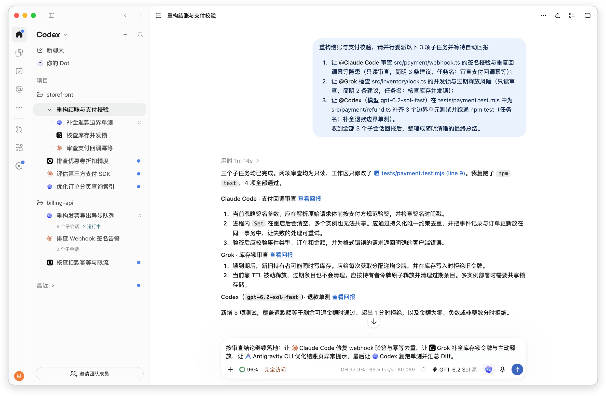
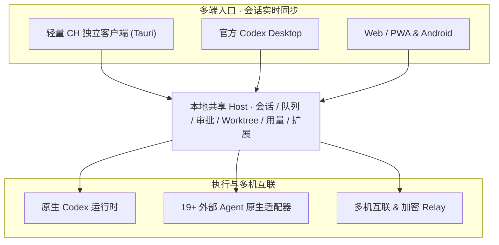
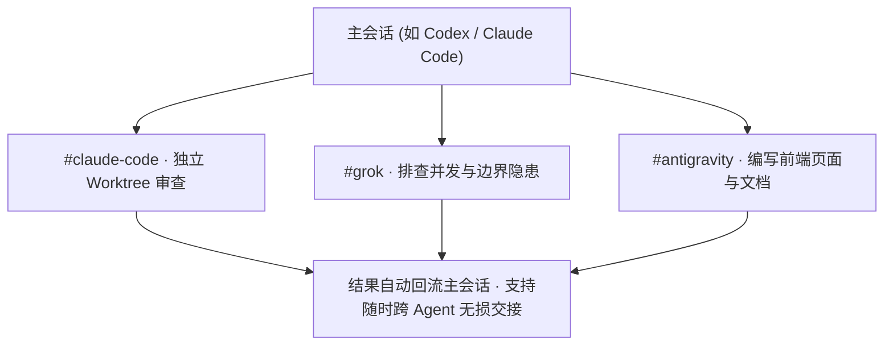
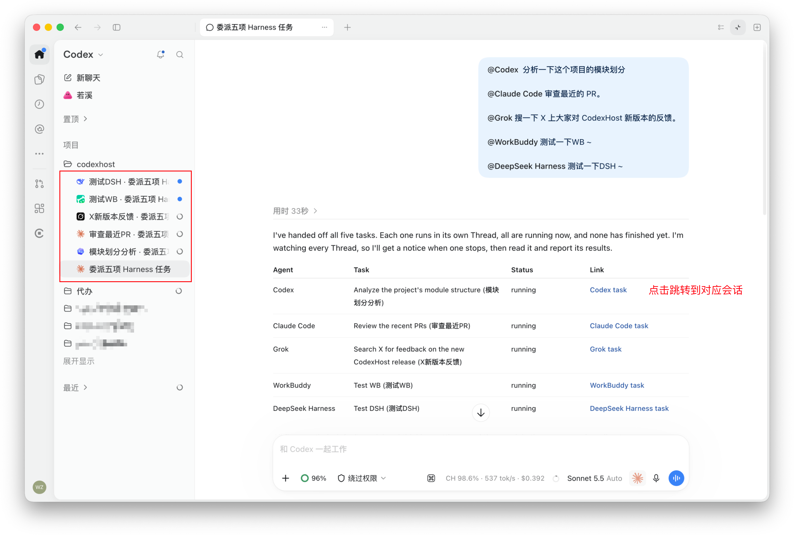
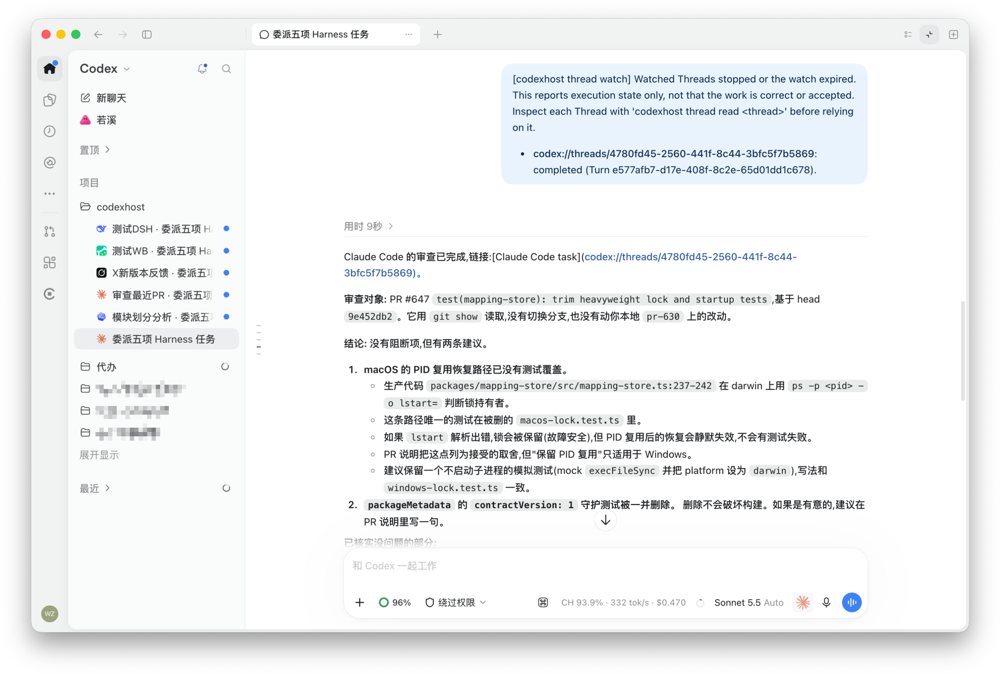
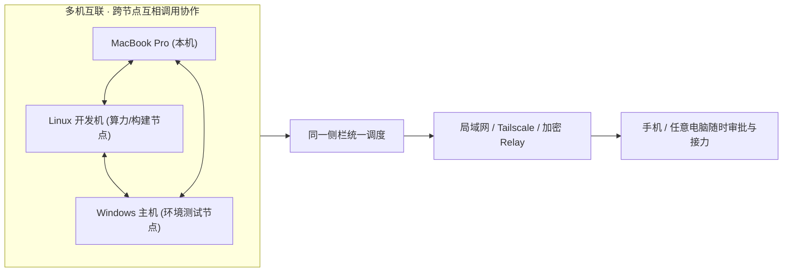

<div align="center">

<p>
  <picture>
    <source media="(prefers-color-scheme: dark)" srcset="../imgs/readme-lockup-dark.png" />
    <source media="(prefers-color-scheme: light)" srcset="../imgs/readme-lockup-light.png" />
    
  </picture>
</p>

<p>
  <a href="https://github.com/BytePioneer-AI/codex-host/stargazers"></a>
  <a href="https://github.com/BytePioneer-AI/codex-host/releases/latest"></a>
  <a href="https://www.npmjs.com/package/@codexhost/cli"></a>
  <a href="../../LICENSE"></a>
  <a href="#下载与安装"></a>
</p>

<p>
  <a href="../../README.md">English</a> ·
  <strong>简体中文</strong> ·
  <a href="README.ko.md">한국어</a>
</p>

<h2>在 Codex 里，调度所有编程 Agent。</h2>

<p>
  把 <b>Codex</b>、<b>Claude Code</b>、<b>Pi</b>、<b>Grok</b> 等 19+ 款编程 Agent 聚进同一工作台；<br />
  自带独立桌面端（无需安装官方 Codex Desktop），也支持增强官方客户端，并与 Web、手机实时多机同步。
</p>

<p>
  <b><a href="https://chost.dev/download">下载 CodexHost</a></b> &nbsp;·&nbsp;
  <b><a href="https://chost.dev">访问官网 →</a></b> &nbsp;·&nbsp;
  <a href="https://github.com/BytePioneer-AI/codex-host/tree/main/docs">文档</a> &nbsp;·&nbsp;
  <a href="#社区与交流群">微信交流群</a>
</p>

<br />

<picture>
  <source media="(prefers-color-scheme: dark)" srcset="../imgs/readme-hero-zh-dark.png" />
  <source media="(prefers-color-scheme: light)" srcset="../imgs/readme-hero-zh-light.png" />
  
</picture>

</div>

---

<a id="赞助"></a>

<details open>
<summary><b>赞助</b></summary>

<br />

<table>
<tr>
<td width="160" align="center"><a href="https://vibeapi.cc/sign-up?aff=AOYp"></a></td>
<td>感谢 <b>VibeAPI</b> 赞助本项目！面向开发者与团队提供 Codex、Claude 等主流 AI 模型统一接入，坚持自建可溯源号池，SLA 稳定性 99.9%、缓存命中率 95%+，支持 7×24 人工技术支持与企业对公开票。<a href="https://vibeapi.cc/sign-up?aff=AOYp">前往了解 VibeAPI →</a></td>
</tr>
</table>

</details>

---

## 核心特性

<table>
<tr>

<td width="25%" valign="top">

### 轻量多端，实时同步

自带轻量 **CodexHost 客户端**，无需依赖官方桌面端，也兼容增强官方 Codex 客户端。

轻量 CH 客户端、官方 Codex 客户端、Web 端与手机端共用同一本地 Host，会话实时同步。

</td>

<td width="25%" valign="top">

### Agent 间真正分工

`#` 派发并行原生子会话，跑完自动回流结果。

聊到一半还能跨 Agent 无损交接上下文。

</td>

<td width="25%" valign="top">

### 多机互联，节点协作

Mac、Linux、Windows 多机互联进同一侧栏，多机会话可互相调用、多个节点联手完成同一任务。

离开电脑，用手机同样随时审批与接力。

</td>

<td width="25%" valign="top">

### 原生能力是一等公民

优先直连各家原生 **SDK / RPC**；即便走 **ACP**，也通过原生接口与 CLI 补全完整能力。

复用本机订阅与凭据，无账号门槛、无第三方代理。

</td>

</tr>
</table>

---

<a id="下载与安装"></a>

## 下载与安装

CodexHost 开源免费，支持 **macOS / Windows / Linux / Android / iOS (PWA)**。本机与局域网内的全部功能**无需注册账号**，也**不要求预先安装官方 Codex Desktop**。

- **客户端下载**：[**官网下载（推荐）**](https://chost.dev/download) · [**GitHub Releases**](https://github.com/BytePioneer-AI/codex-host/releases/latest)（含桌面端、Android APK 与手机端指引；另见 [Linux 说明](../platforms/linux/linux.zh-CN.md)）
- **npm / WinGet 安装**：

```bash
npm install -g @codexhost/cli
# Windows WinGet: winget install --id BytePioneer-AI.CodexHost --exact
```

> [!IMPORTANT]
> **macOS 首次打开提示「应用无法验证」**，在终端执行以下命令放行即可：
> ```bash
> xattr -dr com.apple.quarantine /Applications/codexhost.app
> ```

### 常用 CLI 命令

```bash
codexhost          # 自动启动轻量独立客户端或官方 Codex Desktop 增强模式
codexhost app      # 直接打开轻量 CodexHost 独立客户端
codexhost web      # 启动本地 Web 端并在浏览器打开
codexhost status   # 查看后台 Host 与服务状态
codexhost update   # 升级到最新版本
codexhost stop     # 停止全部后台服务（npm 覆盖安装前请先执行）
```

> **安全提醒**：远程访问的 Access Token、登录链接和配对二维码等同于本机操作权限，请勿公开分享。

<details>
<summary><b>更多排查（本地控制台 / Windows 绿色版 Codex Desktop）</b></summary>

<br />

- **启动失败或官方 Codex Desktop 未加载功能**：运行 `codexhost console`（Windows：开始菜单 → `codexhost console`）打开本地控制台 `http://127.0.0.1:4399/` 查看日志与版本状态。
- **Windows 使用绿色解压版 Codex Desktop**：设置用户环境变量 `CODEXHOST_INSTALL_ROOT` 指向解压目录，完全退出进程后重开终端运行 `codexhost`：
  ```powershell
  [Environment]::SetEnvironmentVariable("CODEXHOST_INSTALL_ROOT", "D:\CodexPortable", "User")
  ```

</details>

---

## 一个后台，三种用法

CodexHost 的本地 Host 作为唯一真相源常驻运行，你可以按场景随时切换最顺手的入口：

<table>
<tr>

<td width="33%" valign="top">

### 轻量独立客户端

**开箱即用，更低内存。**

基于 Tauri 的轻量 CodexHost 原生桌面端，无需安装官方 Codex Desktop，macOS / Windows / Linux 体验一致。

</td>

<td width="33%" valign="top">

### 官方 Codex 增强

**保留习惯，能力倍增。**

无侵入增强官方 Codex Desktop，不修改官方安装包，原生 Diff 审查、Worktree 与审批体验原样保留。

</td>

<td width="33%" valign="top">

### Web 与手机端

**随时随地，实时接管。**

浏览器打开同款界面，搭配 Android 原生 APK 与 iOS PWA，离开工位照样查看进度、审批命令与回复。

</td>

</tr>
</table>

<p align="center">
  <picture>
    <source media="(prefers-color-scheme: dark)" srcset="../imgs/readme-ch-desktop-zh-dark.png" />
    <source media="(prefers-color-scheme: light)" srcset="../imgs/readme-ch-desktop-zh-light.png" />
    
  </picture>
  <sub>轻量 CodexHost 独立客户端（与上方官方 Codex 客户端共用同一本地 Host，实时同步完全一致的会话、委派树与进行中状态）</sub>
</p>


```mermaid
flowchart TB
  subgraph Clients["多端入口 · 会话实时同步"]
    direction LR
    CH["轻量 CH 独立客户端 (Tauri)"]
    CD["官方 Codex Desktop"]
    WM["Web / PWA & Android"]
  end

  HOST["本地共享 Host · 会话 / 队列 / 审批 / Worktree / 用量 / 扩展"]

  subgraph Engines["执行与多机互联"]
    direction LR
    CODEX["原生 Codex 运行时"]
    EXT["19+ 外部 Agent 原生适配器"]
    MESH["多机互联 & 加密 Relay"]
  end

  CH --> HOST
  CD --> HOST
  WM --> HOST
  HOST --> CODEX
  HOST --> EXT
  HOST --> MESH
```

---

## 多 Agent 协作：不只是并排，而是分工与接力

一个 Agent 忙不过来，或者不同任务适合不同模型——在输入框打 `#` 选择目标 Agent，即可拆出独立原生子会话并行执行；聊到一半也能用 **[跨 Agent 无损交接（Handoff）](../architecture/cross-harness-handoff.md)** 把完整上下文无缝交给另一款 Agent 接着干。


```mermaid
flowchart TB
  MAIN["主会话 (如 Codex / Claude Code)"]
  A1["#claude-code · 独立 Worktree 审查"]
  A2["#grok · 排查并发与边界隐患"]
  A3["#antigravity · 编写前端页面与文档"]
  MERGE["结果自动回流主会话 · 支持随时跨 Agent 无损交接"]

  MAIN --> A1
  MAIN --> A2
  MAIN --> A3
  A1 --> MERGE
  A2 --> MERGE
  A3 --> MERGE
```

> 让 `#claude-code` 独立审查这次修改并指出兼容性风险。  
> 让 `#grok` 排查这个模块的并发与边界隐患。  
> 让 `#antigravity` 补齐前端页面与使用文档。

<table>
  <tr>
    <td width="50%" valign="top">
      <p><strong>多个 Agent 并行</strong><br /><sub>各自独立原生会话，互不打扰</sub></p>
      
    </td>
    <td width="50%" valign="top">
      <p><strong>做完自动汇报</strong><br /><sub>委派任务完成后自动通知主会话</sub></p>
      
    </td>
  </tr>
</table>

---

## 离开电脑，多台机器照样在手边


```mermaid
flowchart LR
  subgraph Nodes["多机互联 · 跨节点互相调用协作"]
    direction TB
    M1["MacBook Pro (本机)"]
    M2["Linux 开发机 (算力/构建节点)"]
    M3["Windows 主机 (环境测试节点)"]
    M1 <--> M2
    M2 <--> M3
    M1 <--> M3
  end

  HUB["同一侧栏统一调度"]
  NET["局域网 / Tailscale / 加密 Relay"]
  MOBILE["手机 / 任意电脑随时审批与接力"]

  Nodes --> HUB --> NET --> MOBILE
```

- **[多机互联与跨节点协作](../product/multi-remote-peers.md)**：把多台 Mac、Linux 与 Windows 开发机连成一张协作网络，收进同一侧栏；不同机器上的会话可以互相委派调用，多个节点联手完成同一项任务。
- **[手机扫码即连](../product/web-remote-access.md)**：无需折腾公网端口，支持局域网、Tailscale 与加密中转连接；对合规有要求的团队可一键部署 **[私有化自建 Relay](../product/self-hosted-relay.md)**。
- **本地优先与隐私边界**：代码、对话历史与各家 Agent 凭据全部留在你自己的机器上，直连官方模型服务，不经任何第三方代理。

<details>
<summary><b>进阶：SSH 远程与 Windows Remote Control 连接</b></summary>

<br />

除 Peer Hub 外，也支持复用官方 Codex Desktop 通道操控远端机器上的 Agent（两端需安装相同版本 CodexHost）：
- **macOS / Linux（SSH 远程）**：在被控机执行 `codexhost remote install && codexhost remote start`，详见 [SSH 远程配置与诊断 →](../platforms/remote/remote-ssh-host.zh-CN.md)
- **Windows（Remote Control 实验）**：复用官方 Remote Control 认证，不开放公网端口，详见 [Remote Control 说明 →](../platforms/remote/remote-control-host.zh-CN.md)

</details>

---

## 原生深度与开放生态

<table>
<tr>

<td width="33%" valign="top">

### 原生运行时能力

不把 Agent 降级成纯聊天框。

完整保留 **Plan Mode**、**运行中插话（Steer）**、**后台终端**、**任意消息 Fork**、**实时费用/缓存命中率** 与 **本机账号一键复用**。

</td>

<td width="33%" valign="top">

### 双端扩展与 Skill 库

装一次，桌面与 Web 同步生效。

通过 [Host 扩展体系](../architecture/desktop-ui-extensions.md) 定制面板与挂件，用 [统一 Skill 库](../architecture/skill-library.md) 让所有 Agent 共享同一套工作规范。

</td>

<td width="33%" valign="top">

### 定时任务与开放编排

不止人能用，脚本与外部程序也能调。

用 [Schedules](../product/harness-schedules.md) 定时自动巡检；通过 [CLI / MCP / HTTP](../architecture/external-clients.md)（`codexhost delegate`）从终端或 Bot 调度本机全部 Agent。

</td>

</tr>
</table>

---

<a id="支持的-agent"></a>

## 支持的 Agent

原生支持 **Codex**，并通过官方 SDK / RPC 与 [ACP](https://agentclientprotocol.com/) 预装接入 **19+ 款编程 Agent**（自动复用本机已登录 CLI 与配置）。详细能力支持见 **[各 Harness 能力边界文档 →](../harnesses/capability-boundaries.md)**。

<details>
<summary><b>查看全部预装支持的 Agent</b></summary>

<br />

| | | | |
| :--- | :--- | :--- | :--- |
| [Codex](https://openai.com/codex/) | [Claude Code](https://code.claude.com/docs/en/quickstart) | [Pi](https://pi.dev/) | [Oh My Pi](https://github.com/can1357/oh-my-pi) |
| [OpenCode](https://opencode.ai/docs/) | [Grok](https://grok.com/) | [Cursor CLI](https://cursor.com/docs/cli/overview) | [GitHub Copilot](../harnesses/copilot/copilot-harness-integration.md) |
| [Antigravity (AGY)](https://antigravity.google/product/antigravity-cli) | [Devin](https://docs.devin.ai/cli) | [DeepSeek Harness](https://github.com/deepseek-ai/deepseek-harness) | [Qwen Code](https://github.com/QwenLM/qwen-code) |
| [Kimi Code](https://moonshotai.github.io/kimi-code/) | [Kiro CLI](https://kiro.dev/docs/cli/) | [CodeBuddy](https://www.codebuddy.cn/home/) | [WorkBuddy](https://www.workbuddy.ai/docs/workbuddy/Quickstart) |
| [Qoder / Qoder CN](https://qoder.com/cli) | [Hermes](https://hermes-agent.nousresearch.com/docs) | [ZCode](https://zcode.z.ai/) | [新增自定义 Harness →](../../.agents/skills/codexhost-add-harness/SKILL.md) |

</details>

---

<a id="社区与交流群"></a>

## 社区与交流群

<table align="center">
  <tr>
    <td>
      <strong>微信交流群</strong><br />
      <sub>扫码添加微信（备注「CodexHost」）拉你进交流群，也欢迎直接提 <a href="https://github.com/BytePioneer-AI/codex-host/issues">GitHub Issue</a>：</sub>
      <ul>
        <li><sub>安装配置、远程连机与多 Agent 使用交流</sub></li>
        <li><sub>新 Agent 适配需求、功能建议与开发讨论</sub></li>
        <li><sub>Bug 反馈建议直接提交 <strong>GitHub Issue</strong></sub></li>
      </ul>
    </td>
    <td align="center">
      
    </td>
  </tr>
</table>

<details>
<summary><b>从源码构建与参与开发</b></summary>

<br />

环境要求：Node.js 22.19+ 或 24、Rust（如需调试官方桌面端增强模式，另需安装 Codex Desktop）。详见 [贡献说明](../../CONTRIBUTING.md) 与 [仓库维护自动化](../operations/repository-maintenance.md)。

```bash
git clone https://github.com/BytePioneer-AI/codex-host
cd codex-host
npm ci
npm run start:app   # 启动独立桌面端
```

| 命令 | 作用 |
| :--- | :--- |
| `npm run start:app` | 构建并启动独立桌面端 |
| `npm run start:web` | 构建并启动独立 Web 端（默认热更新） |
| `npm start` | 构建并启动官方 Codex Desktop 增强模式 |
| `npm stop` | 停止当前用户的本地 codexhost 后台服务 |

</details>

---

## 鸣谢与贡献者

感谢 [LINUX DO](https://linux.do/) 社区、[Paseo](https://github.com/getpaseo/paseo)（多 Harness 架构启发）、[DSH（DeepSeek Harness）](https://github.com/deepseek-ai/deepseek-harness)（Web 端基础）以及所有为 CodexHost 做出贡献的开发者。

<a href="https://github.com/BytePioneer-AI/codex-host/graphs/contributors">
  
</a>

## Star History

<a href="https://www.star-history.com/?repos=bytepioneer-ai%2Fcodex-host&type=date&legend=top-left">
  <picture>
    <source media="(prefers-color-scheme: dark)" srcset="https://api.star-history.com/chart?repos=bytepioneer-ai/codex-host&type=date&theme=dark&legend=top-left" />
    <source media="(prefers-color-scheme: light)" srcset="https://api.star-history.com/chart?repos=bytepioneer-ai/codex-host&type=date&legend=top-left" />
    
  </picture>
</a>

## 许可证

本项目采用 [LGPL-3.0](../../LICENSE) 开源许可证。
