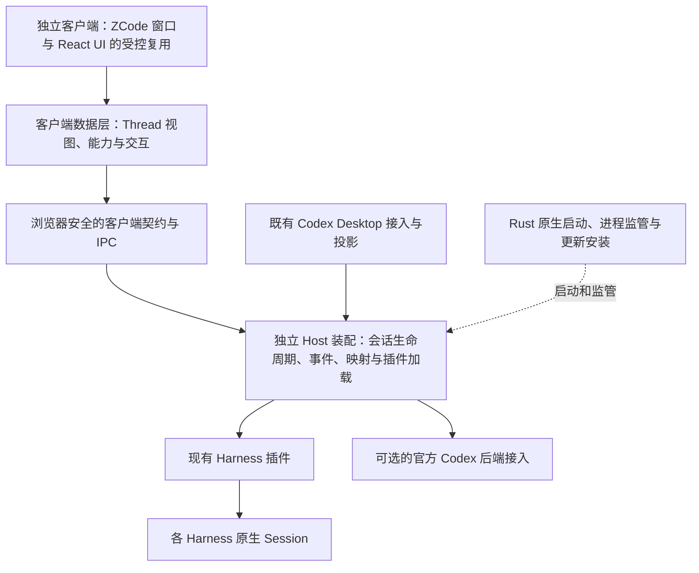
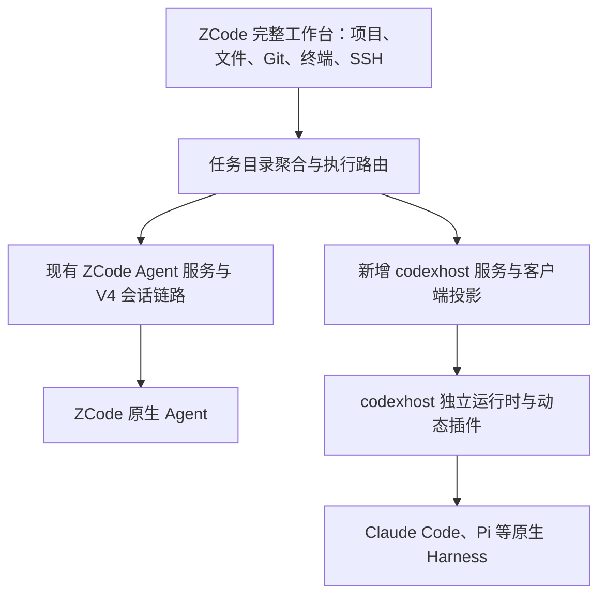

# 借助 ZCode GUI 构建 codexhost 独立客户端：可行性调研

> 2026-09-21；源码调研与方案，尚未实现或运行集成原型。本文不改变当前产品保留官方 Codex Desktop 的既有路径。

## 结论

可行，建议推进一个有明确验收范围的独立客户端原型。ZCode 可以提供 Electron 窗口、React 工作台和展示组件，codexhost 可以提供原生 Harness 插件与会话能力。两者存在可接合的接口，但不能通过替换 CLI 路径或增加一个 Provider 完成接入。

若只需要独立 UI，可以以 ZCode 的窗口与 UI 代码为基础，裁剪原产品装配并改接 codexhost 的会话接口。若希望保留 ZCode 的完整工作台及原生 Agent，则更适合在 ZCode Host 中新增 codexhost 后端服务，让两条执行路径并存，详见下文“保留完整 ZCode，新增 codexhost 后端”。两种路线均保留 Harness 原生执行、认证、权限和历史语义。

“自己的客户端”的验收条件应包括：独立应用身份、独立启动与更新、UI 可自行修改、无需安装或启动官方 Codex Desktop、外部 Harness 不依赖官方 Codex 后端可用、无必需的 ZCode 产品账号。使用 Codex Harness 本身时仍需要它自己的原生运行时与认证。

## 调研基线与验证范围

| 项目 | 本次基线 |
| --- | --- |
| ZCode 仓库 | <https://github.com/zai-org/ZCode> |
| 本地位置 | codexhost 的同级目录 `../ZCode`，未放入 codexhost Git 仓库 |
| ZCode 提交 | `872ad960de7ec172591f7e1952f7849229f94521`，`feat: open source` |
| ZCode 根包版本 | `3.14.0` |
| codexhost HEAD | `fb36f2dfee08cb8db68d3eee362f02a7ca61d3ae`；检查时工作区存在其他未提交改动 |
| 实际检查 | 完整 clone；源码、契约、装配、发行清单与许可文件静态阅读 |
| 基线检查 | `node scripts/check-workspace-freshness.mjs` 通过，与 `origin/main` 同步 |
| 类型与 lint | 执行了 `pnpm typecheck`、`pnpm lint`，均未通过；未安装 workspace 依赖，前者出现大量模块缺失等错误，后者找不到 `oxlint` |
| 未执行 | 依赖 bootstrap、桌面构建与启动、真实 Harness 集成、跨平台打包、性能或 UI 质量验收 |

缺依赖情况下的类型检查不能用来判断上游源码本身是否存在同样的缺陷。本次“可行”是架构判断，不是运行成功声明。

## ZCode 有什么可复用

它是完整工作台源码，Desktop 与 Web 使用同一个 `@zcode/ui`。技术组合包括 Electron、React 19、TypeScript、Zustand、Tailwind、xterm 和 Diff 展示库，与 codexhost 的 TypeScript 后端可以组合。

| 范围 | 源码依据 | 复用判断 |
| --- | --- | --- |
| 桌面窗口、标题栏与平台适配 | `packages/desktop/src/main/desktopWindowChrome.ts`、`packages/shared/src/platform.ts` | 适合作为基础；应用身份、原生桥和生命周期需要接入自己的产品 |
| 主题、布局、基础控件、Markdown、代码与 Diff 展示 | `packages/ui/src/styles.css`、`components/`、`root/`、`ToolCallBlocks/` | 优先复用；业务组件仍需检查 hooks 与服务依赖 |
| 文件树与终端界面 | `workspace-file-tree/`、`terminal/TerminalSession.tsx` | 可复用前端；文件监听、Git、PTY 等后端能力也要配套 |
| 平台及服务注入 | `hooks/useServices.tsx`、`hooks/usePlatform.tsx`、`packages/services/src/accessor.ts` | 有明确替换入口，但整个 `IServiceAccessor` 很宽，不能认为注入一项就完成替换 |
| 会话时间线与输入框 | `v4/SessionPane.tsx`、`v4/ConversationRowView.tsx` | 有价值但需要改造数据依赖；并非独立无状态组件库 |
| 桌面/Web 传输 | Desktop `renderer/src/main.tsx` 使用 MessagePort，Web `src/main.tsx` 使用 WebSocket | 说明 UI 已与物理传输分开；不代表后端业务协议可互换 |
| SSH、WSL、手机远控、工作流、自动任务、CUA | Desktop Host、Server、Services 与 CLI 的联合实现 | 留作后续能力，不能算作换壳即得 |

几个聚合文件的规模也显示出真实改造成本：当前 `SessionPane.tsx` 为 4,834 行，`zcodeAgentService.ts` 为 5,646 行，`zcodeTaskServiceAdapter.ts` 为 5,737 行。这些数字仅说明业务集中度，不代表质量评价或可复用比例。

源码入口：[Desktop Renderer](https://github.com/zai-org/ZCode/blob/872ad960de7ec172591f7e1952f7849229f94521/packages/desktop/src/renderer/src/main.tsx)、[Web Renderer](https://github.com/zai-org/ZCode/blob/872ad960de7ec172591f7e1952f7849229f94521/packages/web/src/main.tsx)、[服务集合](https://github.com/zai-org/ZCode/blob/872ad960de7ec172591f7e1952f7849229f94521/packages/services/src/accessor.ts)。

## 最关键的接合限制

### 1. ZCode 的默认执行路径是自己的 Agent

[`ZCODE_AGENT_RUNTIME`](https://github.com/zai-org/ZCode/blob/872ad960de7ec172591f7e1952f7849229f94521/packages/shared/src/zcode-agent-runtime.ts) 指定自己的 Agent 资源、配置目录和 `app-server --stdio` 参数。`packages/services/src/node.ts` 将它与 Provider、账号、Coding Plan 等服务共同装配。

相同的 `app-server` 名称和 stdio 传输不等于相同协议。把 `GLM_BINARY_PATH` 指向 codexhost 不会完成兼容。ZCode 的 Model/Provider 选择也不是 codexhost 的 Harness 选择；导入其他产品历史的代码不能证明它能运行那些产品的原生 Harness。

### 2. 聊天数据层依赖 ZCode V4

[`ConversationTransport`](https://github.com/zai-org/ZCode/blob/872ad960de7ec172591f7e1952f7849229f94521/packages/ui/src/v4/transport.ts) 是一个真实的替换位置，但接口包含：

- snapshot/delta 订阅、激活屏障、重同步、历史分页；
- command ACK、按 commandId 对账、重连后的命令状态；
- 附件传输、文件变化、文件撤销预览；
- 工作流事件、产物和运行状态。

此外 [`IZCodeAgentService`](https://github.com/zai-org/ZCode/blob/872ad960de7ec172591f7e1952f7849229f94521/packages/services/src/zcode-agent/zcodeAgent.ts) 还有独立的 Sessions Index 和 Workspace Config 订阅。只替换 ConversationTransport 不能让完整工作台运转。

如果完整保留这一层，需要承担 ZCode 的版本、状态与重连语义；若以组件复用为主，可以改写会话 hooks/store 与装配，把 ZCode 的显示类型限制在客户端内部。

### 3. codexhost 的插件已经可用，独立客户端后端尚未成型

可复用的真实资产：

- [`HarnessAdapter` / `HarnessSession`](../../packages/harness-adapter/src/text-session.ts)：inspect、open、execute、outputs、readSnapshot、close，以及原生模型、Thinking、权限、交互和历史契约。
- [动态插件加载](../../packages/host-runtime/src/harness-plugin-loader.ts)、[插件注册表](../../packages/host-runtime/src/harness-plugin-registry.ts)、[CLI 发现](../../packages/harness-discovery/src/index.ts)。
- [映射记录](../../packages/mapping-store/src/records.ts)：Thread 与 Native Session 身份、Turn 定位、标题、归档等元数据。
- 已有的恢复、Fork、修订、原生命令、子任务与委派实现；逐项保留原生能力限制。

当前[发行清单](../../scripts/release/harness-plugins.json)列出 14 个插件入口，包含两个 Qoder 版本；应以清单和源码为准，不能直接引用部分旧文档里的“七个”。这也不代表 14 个插件在新客户端上已经验收通过。

需要解耦的真实位置：

- [`runHostRuntime`](../../packages/host-runtime/src/run-host-runtime.ts) 要求 `CODEXHOST_STOCK_CODEX_PATH`，普通启动路径准备官方 Codex 后端。
- [`AppServerHost`](../../packages/host-runtime/src/app-server-host.ts) 组合官方连接与外部 Harness，初始化和请求仍围绕 Codex app-server 协议。它能够容忍部分官方连接故障，但这不等于已提供独立、无官方配置的生产启动入口。
- [`ExternalThreadRuntime`](../../packages/host-runtime/src/external-thread-runtime.ts) 的内部结构仍带 `CodexTurnProjector`、运输 Model ID 和 Codex JSON 投影，不能原样称为 UI 无关内核。
- `host-runtime` 的包依赖和入口仍关联 `desktop-control`；`renderer-extension` 是官方 UI 注入实现，新客户端应通过正式接口替代这条路径。
- 现有公共导出没有完整独立的 Thread 应用服务。不能从新客户端跨包导入 `src` 私有实现来绕过这一缺口。

### 4. 高级 UI 能力不等于后端已有能力

当前 `TurnStartCommand.input` 为 `HostTextInput[]`，每项只有 `type: "text"` 和 `text`。图片、视频和文件附件输入需要先扩展公共契约，再逐 Harness 实现与声明支持；本地文件预览与发给模型是两件事。

同样需要保留这些区别：

- Harness 固定属于 Thread，不能借模型下拉框在已有 Thread 中切换 Harness。
- 权限档位来自当前 Harness，不能把 ZCode 的模式统一套给 Claude Code、Pi 等。
- 原生 Fork/修订与工作区文件回滚是两种能力；不能把 ZCode 文件撤销按钮接到会话 rollback。
- 原生不提供的上下文压缩、Usage、精确 Fork、子任务历史，应明确禁用或标注未知。
- 不支持命令重放和幂等确认时，断线后应先对账，不能自动重发可能已经执行的 Turn。
- ZCode 的插件商店管理 Agent 的 skills/hooks/MCP 等扩展，与 codexhost 的 Harness 插件不是同一类插件。

## 建议的架构

这是目标结构，图中的独立 Host 与客户端契约尚需实现。可先在现有拥有职责的包内抽出接口，再依据真实依赖决定是否另建包；不以创建大量新 package 作为解耦的替代。

归属与状态规则：

1. 原生 Harness 保存执行状态和历史事实；Host 保存映射与协调元数据。客户端 store 维护展示投影、草稿、选择和滚动状态，不成为第二套原生会话数据库。
2. Host 统一提供目录/能力查询、Thread 创建与恢复、读取、执行/取消、交互响应、配置选择与事件订阅。Renderer 只接收可序列化且经校验的数据，不持有 SDK、环境变量或完整 Native Ref。
3. 实时事件与历史 snapshot 使用稳定身份对齐；订阅建立期间不丢事件。重连、进程换代、交互过期与取消必须有明确结果。是否支持持久 replay 由契约说明，不制造上游没有的执行承诺。
4. Harness 插件继续按 manifest 动态加载；客户端 Picker 使用目录与能力驱动，不复制硬编码 Harness 名单。
5. Codex 当前不是普通外部 Harness 插件。接入独立客户端时单独处理原生连接、初始化、认证、历史和事件展示；不靠伪造插件 ID 绕过现有保留 ID 规则。
6. Rust 继续拥有原生启动、进程管理、更新安装和平台集成；Electron 提供窗口与 preload 桥。复用 ZCode 时需调整它现有 Main/Host 的进程调度职责，避免两套监管与更新器同时拥有相同资源。
7. 文件、Git、终端等工作台服务与 Harness 工具执行分开归属，可以按模块移植 ZCode 实现并接入原生平台层。不能因为某 Harness 有 Shell 工具，就认为独立终端服务已经存在。

旧 Desktop 兼容入口可以作为另一个消费者保留，逐步共享抽出的后端逻辑。这样可分阶段验证新客户端，并继续维护既有使用路径。

## 路线比较

| 路线 | 收益 | 代价 | 建议 |
| --- | --- | --- | --- |
| 完整 ZCode UI + 实现 ZCode V4 兼容后端 | UI 改动相对集中 | 要接管会话、目录、配置、命令对账等协议；容易扩成第二套 ZCode runtime | 仅适合范围严格受限的试验，不能称为薄适配 |
| 保留完整 ZCode，新增 codexhost 后端 | 复用工作台、平台服务、SSH 和原生 Agent | 新增服务通道、任务归属与 UI 能力路由；维护两条执行路径 | 保留完整工作台目标下优先推荐 |
| 复用窗口、布局和展示组件，重接客户端数据层 | 保留 UI 投入，并以 codexhost 语义为主 | 需要裁剪 Root、SessionPane、设置、Provider 及服务装配 | 仅需独立 UI 时适用 |
| 全新编写 UI | 产品模型最自由 | 终端、文件树、Diff、输入框和平台体验重新开发 | 可作为后续局部替换方式，当前无需从零开始 |

不建议把 `HostEvent` 先投影成 Codex 私有 UI 数据，再转换为 ZCode 数据作为长期主链路。这会引入两次语义折损。既有 Codex 协议可用于早期连通探针，正式独立客户端应面向稳定的 Host 语义。

源码管理建议：保留当前 `../ZCode` 为干净参考仓库，试验在独立分支或独立客户端仓库进行，固定上游提交并记录移植来源。首个闭环完成后决定是长期维护 fork 还是把确定需要的模块纳入 workspace；避免一开始把整套 monorepo 和 pnpm 构建链合并到 codexhost 的 npm workspace。

## 保留完整 ZCode，新增 codexhost 后端

这是与“完整实现 ZCode V4 兼容后端”不同的路线：保留现有 ZCode Agent 的 V4 链路，为 codexhost 新增自己的服务通道与会话展示接入，再在工作台层聚合目录、任务列表和导航。客户端可以共享显示组件，无需要求所有 Harness 实现 ZCode 的完整运行时协议。

源码中的实际扩展位置：

- `packages/services/src/descriptors.ts` 定义按 channelName 标识的服务，`node.ts` 负责本地服务装配。
- `packages/services/src/accessor.ts` 和 `packages/client/src/remoteServiceAccess.ts` 定义消费接口与 RPC 代理，可增加 codexhost 服务。
- `packages/desktop/src/host/remoteWorkspaceServiceCollection.ts` 显式装配远程工作区服务；远端部署、通道注册与这里的转发都要同步扩展，仅加客户端 getter 不够。
- `packages/ui/src/lib/rootStartupGate.ts` 和 `Root.tsx` 有应用级 Provider/认证就绪检查，新增后端时需将执行准入限定到相应路径。
- `packages/shared/src/zcode-protocol-v4/sessions-index.ts` 当前会话摘要没有跨后端归属字段。建议在工作台聚合层增加任务路由记录，而不是让 ZCode CLI 数据库保存外部 Harness 历史。

目标结构如下，所有新增部分均为方案：

任务持久化路由至少需要区分执行后端、所属 Harness、目标 Host/工作区身份与后端任务 ID。这些是内部归属信息；用户界面可以直接展示 ZCode、Claude Code、Pi 等 Agent，不必强迫用户先理解两种后端。已有 ZCode 任务保持原归属，新任务显式选择；相同字符串 ID 来自不同后端时不能合并。

codexhost 在这里是管理多个 Harness 的后端，不应被注册成一个模型 Provider。也无需先将 ZCode 自己改造成 codexhost 插件：原有路径可以直接保留，等出现明确统一需求后再评估。

本地可以将 codexhost 作为独立受管进程隔离故障，ZCode Host 只桥接请求与事件；原生进程监管应对齐 codexhost 现有 Rust 职责。当前 codexhost 生产入口仍需先完成前述官方后端解耦，不能把现有入口原样包装就声称接入完成。

远程可以复用 ZCode 的 SSH 连接、资源传输和工作区服务通信，在远端增量部署 codexhost 与插件。执行路由必须同时携带远程身份；Harness CLI、认证和 Session 位于实际执行主机，不自动继承桌面设备的安装或登录状态。新增服务要支持版本/能力检查，使未部署 codexhost 的远端仍能运行原有 ZCode 功能。

能力应分为共享工作台能力与执行路径专属能力：文件浏览、Git、独立终端可以共同使用；ZCode 的原生工作流、记忆、MCP、CUA、Goal、附件和文件检查点不会因任务进入同一工作台而自动适用于外部 Harness。相关入口必须按所选任务的实际能力路由，不能发到错误的 Agent。

此路线的首个验收增加两项：同一工作区中 ZCode 原生任务与两个外部 Harness 任务可并存；ZCode Provider 不可用时，已满足自身条件的外部 Harness 仍能使用。随后验证 SSH 下相同闭环。ZCode 账号、套餐和其他产品服务可以保留给原生路径，但不能成为外部 Harness 的全局使用前提。

## 分阶段验证

### 阶段一：证明 UI 与多 Harness 的最小闭环

先做本机 macOS、一个工作区、Claude Code 与 Pi 两个已有插件。原型包括独立窗口、Harness 目录、创建 Thread、文本输入、流式文本/工具展示、停止、支持情况下的真实审批/提问、历史恢复。

关键验收：

- 不启动官方 Codex Desktop；不依赖 ZCode Agent 执行所选外部 Harness。
- 一个 Thread 只创建/恢复一个对应的原生 Session；两个 Harness 的 Thread 可独立运行。
- 取消受理与执行终态分开；迟到事件不会进入另一轮。
- 审批/提问关联正确；过期或取消后的交互不可重复响应。
- 关闭并重开客户端，恢复到同一个原生会话，历史不重复也不凭空补造。
- UI 按能力展示差异，例如 Pi 不提供原生权限模式目录时不出现假权限档位。
- 使用隔离的原型元数据目录；在并发写入与所有权行为验证前，不让新旧客户端同时操作同一套生产映射或原生 Session。

阶段一先验证最难的生命周期与数据一致性，再依据实际改动量估算工期；当前没有足够证据给出可靠复用百分比或固定交付日期。

### 阶段二：形成可日常使用的客户端

加入模型/Thinking/权限设置、原生命令、会话导入、Fork/修订、子任务、账号只读状态、文件树、Git/Diff、PTY、多工作区与性能治理；接入 Codex 原生后端，并证明外部 Harness 的使用不依赖它安装或登录。

客户端上线不应隐含所有 Harness 功能一致。能力基线沿用现有契约与[能力边界](../harnesses/capability-boundaries.md)，以逐插件验收结果发布。

### 阶段三：独立发行与扩展能力

独立 app ID、用户数据目录、图标、安装包、签名、公证与更新源；按目标平台验证 Windows/Linux。再分别设计附件、远程连接、Web/手机端、自动化与 CUA。ZCode 的远程与自动化代码可作为实现来源，但需要重新对齐 Host 所有权和 Harness 能力。

## 产品服务与许可

ZCode 第一方代码采用 [Apache-2.0](https://github.com/zai-org/ZCode/blob/872ad960de7ec172591f7e1952f7849229f94521/LICENSE)，允许依条款修改和再分发。发行时保留适用许可、版权及归属声明，注明文件修改；该许可不自动授权上游商标。第三方依赖与素材应按实际发行内容保留自己的条款，不能将整个派生产品中的上游部分简单重标为 codexhost 的 MIT。

[`NOTICE.md`](https://github.com/zai-org/ZCode/blob/872ad960de7ec172591f7e1952f7849229f94521/NOTICE.md) 还明确区分第一方代码与第三方资源，并说明账号、网关、远控、分享和更新等网络行为。自己的产品需要重新装配账号入口、Coding Plan、模型网关、遥测、插件市场、反馈、分享和更新；改应用名称不能完成这项工作。

本次未执行完整依赖与素材许可审计，也未验证这些上游服务对派生客户端可用。首个客户端闭环应只保留确有需要的本地能力与用户所选 Harness 的原生连接。
